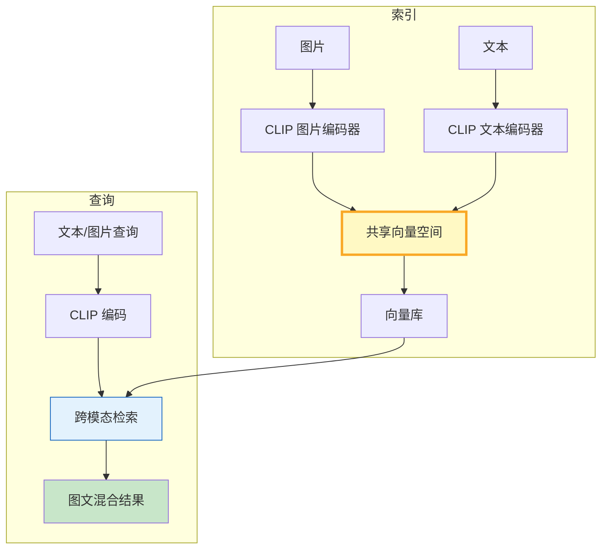

# 多模态检索与跨模态对齐图解

> CLIP 把图片和文本编码到同一向量空间，实现用文字搜图片、用图片搜文字。

---

---

## 模态对齐对比

| 方案 | 文本编码 | 图片编码 | 对齐方式 | 适用 |
|------|----------|----------|----------|------|
| CLIP | Transformer | ViT | 对比学习 | 通用 |
| BLIP | BERT | ViT | 生成+对比 | 理解+生成 |
| 文本描述法 | 文本模型 | 文本模型 | 图片转文字 | 无CLIP时 |

---

## 检查清单

| 检查项 | 状态 |
|--------|------|
| 有多模态块定义 | ☐ |
| 有CLIP编码 | ☐ |
| 有统一向量空间 | ☐ |
| 有模态过滤 | ☐ |
| 有图文混合结果 | ☐ |
