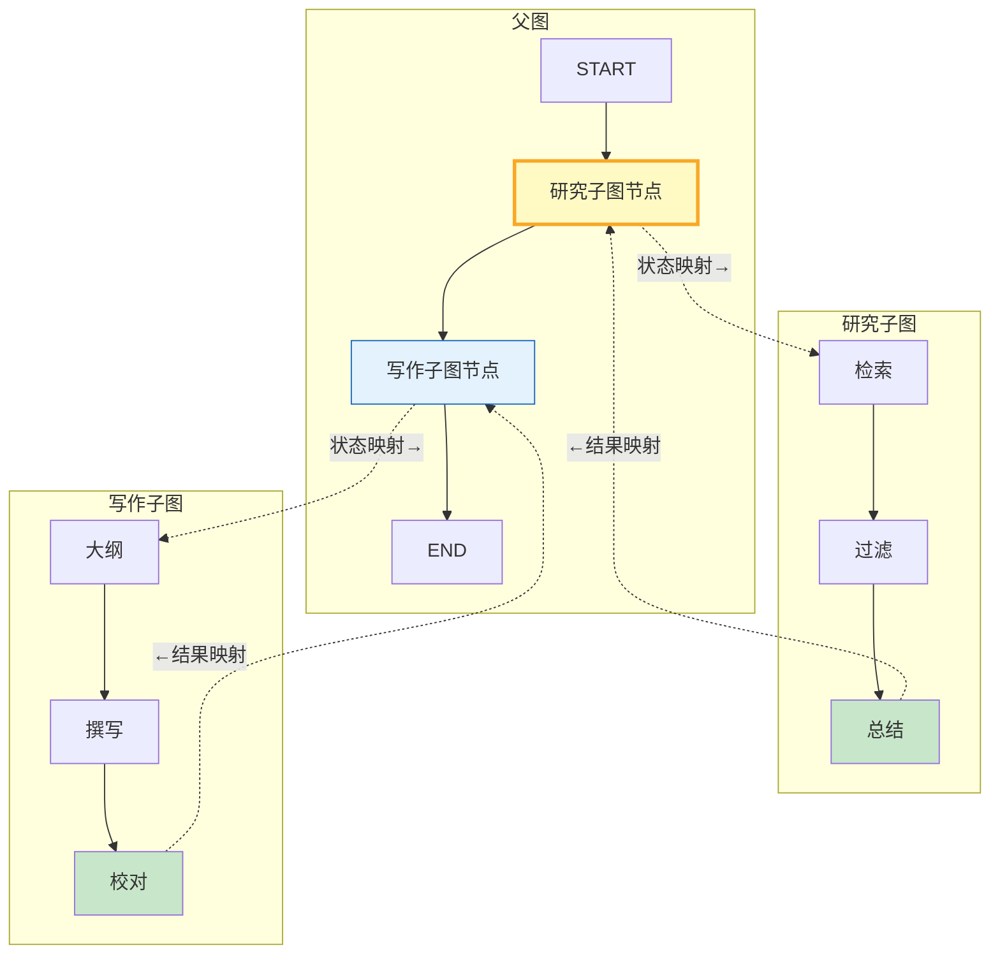

# LangGraph 子图通信与消息传递图解

> 子图作为父图节点运行，通过状态映射与父图交换数据。

---

---

## 通信模式对比

| 模式 | 原理 | 适用 |
|------|------|------|
| 状态映射 | 父图节点手动转换 | 字段不匹配 |
| 共享状态 | 相同TypedDict | 字段重叠 |
| 消息传递 | messages列表 | 对话型 |
| 通道映射 | reducer合并 | 多子图并行 |

---

## 检查清单

| 检查项 | 状态 |
|--------|------|
| 有独立子图状态 | ☐ |
| 有父图状态 | ☐ |
| 有状态映射 | ☐ |
| 有子图编译 | ☐ |
| 有端到端运行 | ☐ |
