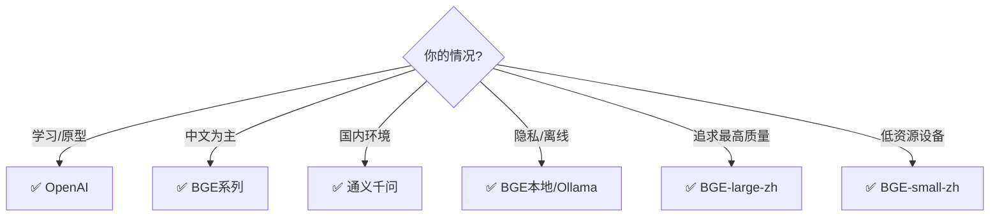

# Embedding 模型选择图解

> 用图解理解 Embedding 模型在 RAG 中的角色和选型决策。

---

## 一、Embedding 在 RAG 中的位置

```mermaid
graph LR
    subgraph 离线 {"离线建库"}
        D["文档"] --> E1["Embedding<br/>模型A"]
        E1 --> V[("向量库")]
    end

    subgraph 在线 {"在线查询"}
        Q["查询"] --> E2["Embedding<br/>模型A(必须相同!)"]
        E2 --> V
        V --> R["检索结果"]
    end

    style E1 fill:'#FFF9C4'
    style E2 fill:'#FFF9C4'
    style V fill:'#F3E5F5'
```

## 二、模型对比

```mermaid
graph TB
    subgraph API模型 {"API模型（需网络）"}
        OAI["OpenAI 3-small<br/>维度:1536 中文★★★★<br/>成本:$0.02/1M"]
        QWEN["通义千问 v2<br/>维度:1536 中文★★★★<br/>成本:低"]
    end

    subgraph 本地模型 {"本地模型（免费+隐私）"}
        BGE_S["BGE-small-zh<br/>维度:512 中文★★★★★<br/>内存:~200MB"]
        BGE_B["BGE-base-zh<br/>维度:768 中文★★★★★<br/>内存:~400MB"]
        BGE_L["BGE-large-zh<br/>维度:1024 中文★★★★★<br/>内存:~1.2GB"]
        OLLAMA["Ollama nomic<br/>维度:768 中文★★★<br/>内存:~300MB"]
    end

    style API模型 fill:'#E3F2FD'
    style 本地模型 fill:'#C8E6C9'
```

## 三、选型决策



## 四、维度影响

```mermaid
graph TB
    subgraph 维度影响 {"维度对性能的影响"}
        V512["512维<br/>内存:小 速度:快<br/>精度:中<br/>→ 小规模(<10万)"]
        V768["768维<br/>内存:中 速度:中<br/>精度:中高<br/>→ 中规模(10-100万)"]
        V1024["1024维<br/>内存:大 速度:中<br/>精度:高<br/>→ 大规模(100万+)"]
        V1536["1536维<br/>内存:大 速度:慢<br/>精度:高<br/>→ 追求精度"]
    end

    style V512 fill:'#C8E6C9'
    style V1536 fill:'#FFE0B2'
```

## 五、关键注意事项

```mermaid
graph TB
    subgraph 注意 {"⚠️ 关键注意事项"}
        N1["1. 文档和查询必须用同一模型"]
        N2["2. 切换模型需重建向量库"]
        N3["3. 中文用中文优化模型"]
        N4["4. 维度高≠效果好"]
    end

    style 注意 fill:'#FFCDD2'
```
