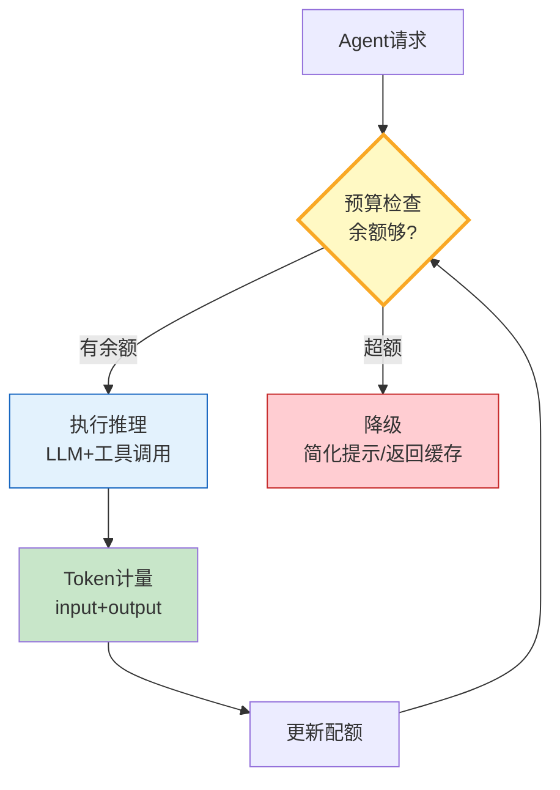

# 推理预算与 Token 配额图解

> 每次推理前检查预算，推理后计量消耗并更新配额，超额自动降级。

---

---

## 预算级别对比

| 级别 | 输入上限 | 输出上限 | 工具调用 | 适用 |
|------|----------|----------|----------|------|
| 宽松 | 8000 | 4000 | 20 | 深度研究 |
| 均衡 | 4000 | 2000 | 10 | 生产任务 |
| 严格 | 2000 | 1000 | 5 | 高并发 |

---

## 检查清单

| 检查项 | 状态 |
|--------|------|
| 有TokenBudget | ☐ |
| 有TokenUsage计量 | ☐ |
| 有预算检查 | ☐ |
| 有超额降级 | ☐ |
| 有上下文截断 | ☐ |
| 有消耗报告 | ☐ |
