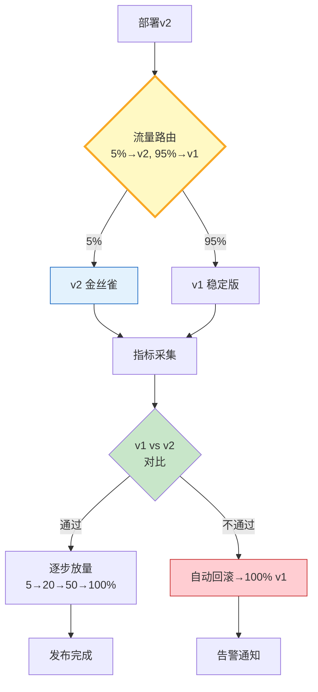

# 金丝雀发布与流量切换图解

> 小流量验证 → 指标对比 → 逐步放量或自动回滚。

---

---

## 放量策略对比

| 策略 | 步骤 | 回滚条件 | 适用 |
|------|------|----------|------|
| 分步放量 | 5→20→50→100 | 错误率超标 | 生产环境 |
| 按用户分批 | 1%→10%→50% | 负面反馈 | ToC应用 |
| 暗启动 | 0%→内部→100% | 内部评估 | 高风险变更 |

---

## 检查清单

| 检查项 | 状态 |
|--------|------|
| 有流量路由器 | ☐ |
| 有指标采集 | ☐ |
| 有自动评估 | ☐ |
| 有分步放量 | ☐ |
| 有自动回滚 | ☐ |
| 有一致性哈希 | ☐ |
