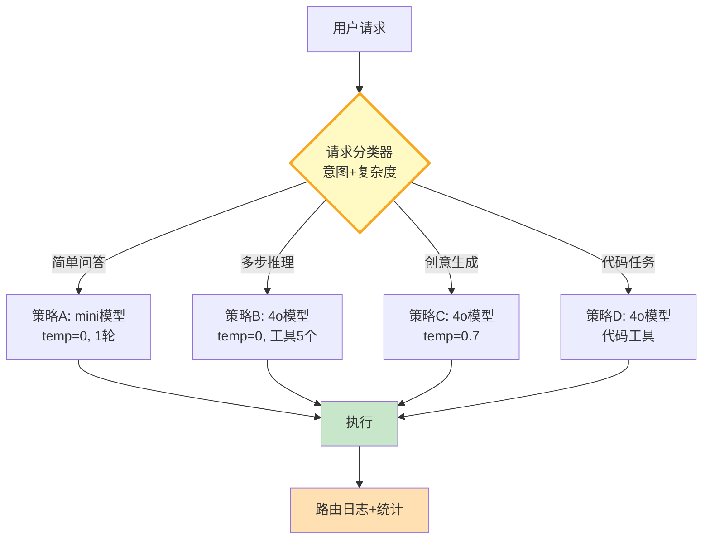

# Agent 多策略路由与动态选择图解

> 分类器先判定请求特征，再从策略表中选择最优配置执行。

---

---

## 策略对比

| 策略 | 模型 | 温度 | 工具 | 迭代 | 适用 |
|------|------|------|------|------|------|
| 简单问答 | mini | 0 | 无 | 1 | 事实查询 |
| 多步推理 | 4o | 0 | 5个 | 8 | 分析决策 |
| 创意生成 | 4o | 0.7 | 无 | 2 | 写作 |
| 代码任务 | 4o | 0 | 代码工具 | 6 | 编程 |

---

## 检查清单

| 检查项 | 状态 |
|--------|------|
| 有策略定义 | ☐ |
| 有请求分类器 | ☐ |
| 有策略路由器 | ☐ |
| 有路由日志 | ☐ |
| 有路由统计 | ☐ |
