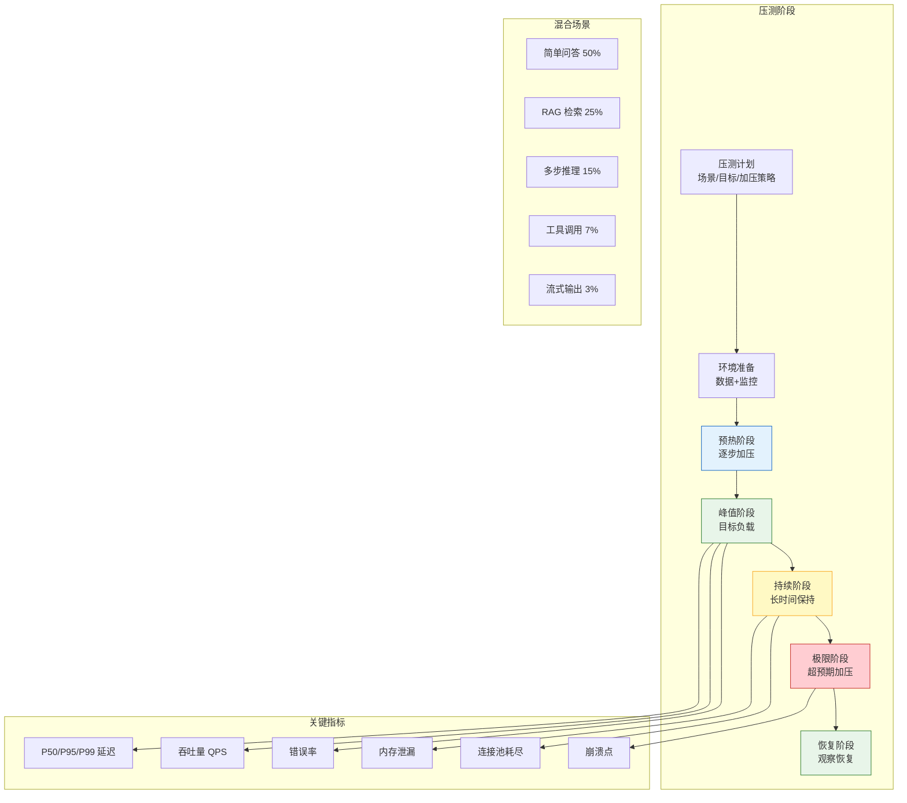

# LLM 应用全链路压测与性能基准图解

> 全链路压测模拟真实用户行为——并发请求、混合场景、逐步加压、长时间持续——找出系统的降级点和崩溃点。

---

---

## 加压策略对比

| 策略 | 方式 | 目的 |
|------|------|------|
| 阶梯加压 | 10→50→100→200 QPS | 找拐点 |
| 恒定负载 | 固定 QPS 持续 30min | 测稳定性 |
| 脉冲突发 | 瞬间 10x 流量 | 测弹性 |
| 长时间跑 | 低负载 24h | 测内存泄漏 |

---

## 性能基准基线

| 指标 | 基线值 | 告警阈值 |
|------|--------|----------|
| P50 延迟 | 500ms | > 1s |
| P95 延迟 | 2s | > 5s |
| P99 延迟 | 5s | > 10s |
| QPS | 100 | < 50 |
| 错误率 | 0.1% | > 1% |
| GPU 利用率 | 70% | > 90% |

---

## 检查清单

| 检查项 | 状态 |
|--------|------|
| 有压测计划 | ☐ |
| 有混合场景 | ☐ |
| 有逐步加压 | ☐ |
| 有持续测试 | ☐ |
| 有性能基线 | ☐ |
| 有监控仪表盘 | ☐ |
| 有瓶颈分析 | ☐ |
