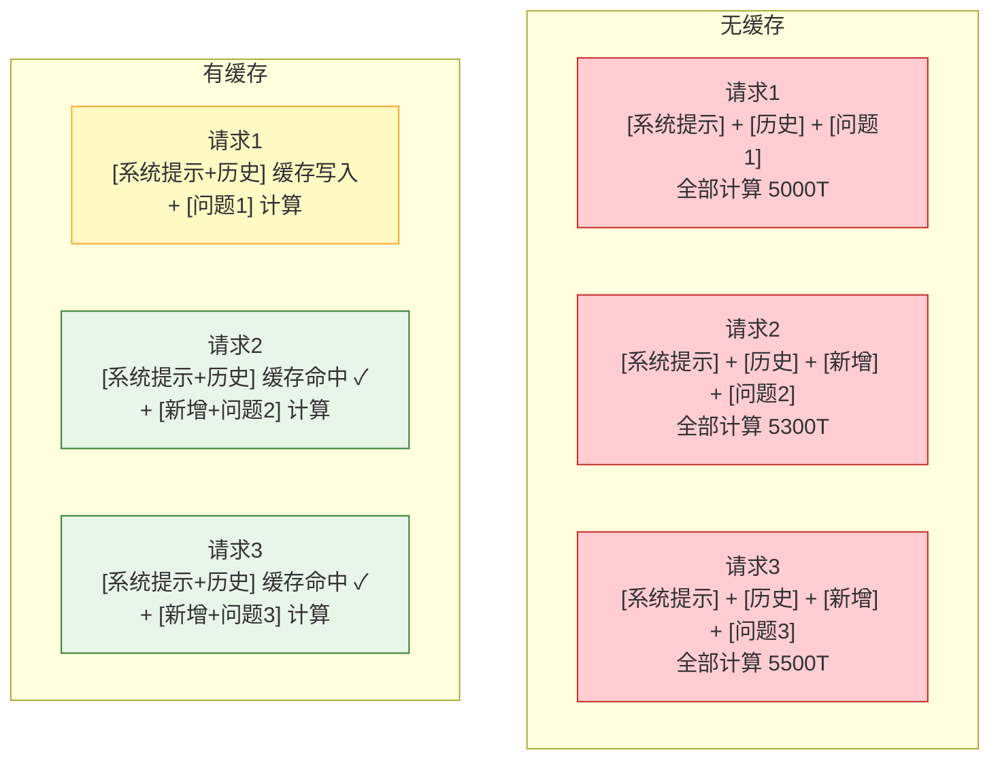

# Prompt 缓存与上下文复用图解

> 稳定前缀缓存后，后续请求只计算新增部分，延迟降低 5-10 倍，成本降低 50-90%。

---



---

## 缓存友好的 Prompt 结构

```
✅ 友好：[稳定系统提示] → [稳定知识库] → [Few-Shot] → [增长历史] → [新问题]
                                全部可缓存                    新增部分

❌ 不友好：[时间戳] → [系统提示] → [问题]
            变化     稳定         变化
            ↑ 破坏缓存
```

---

## 成本对比

| 方式 | 输入 | 单价 | 每百万成本 | 节省 |
|------|------|------|-----------|------|
| 无缓存 | 5000T | $2.50 | $12.50 | — |
| OpenAI 缓存 | 5000T(4000缓存) | Read $1.25 | $6.25 | 50% |
| Anthropic 缓存 | 5000T(4000缓存) | Read $0.30 | $4.20 | 66% |

---

## 检查清单

| 检查项 | 状态 |
|--------|------|
| 稳定内容在最前 | ☐ |
| 无时间戳/随机值 | ☐ |
| Few-Shot 在系统提示 | ☐ |
| temperature=0 | ☐ |
| 有缓存命中率监控 | ☐ |
| 有成本节省统计 | ☐ |
