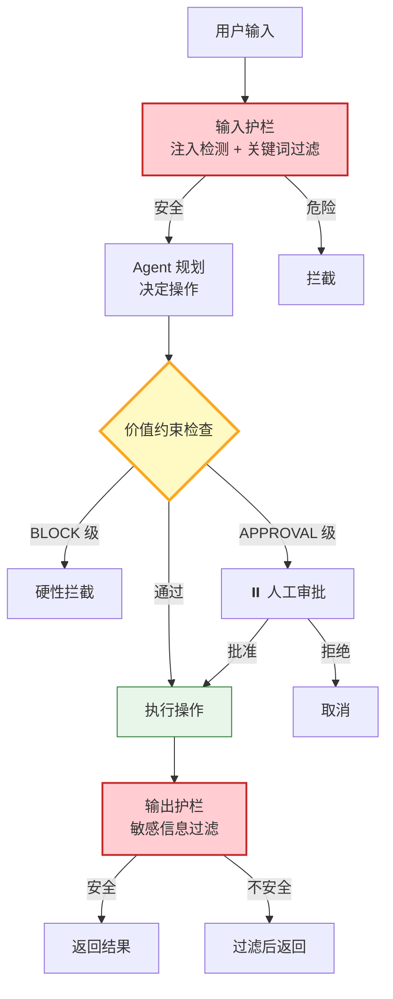

# Agent 对齐与价值约束图解

> 通过输入护栏 → 价值约束 → 输出护栏三层防线，确保 Agent 行为符合人类意图和安全边界。

---



---

## 对齐三个层次

| 层次 | 目标 | 示例 |
|------|------|------|
| 意图对齐 | 理解用户真正想要什么 | "删测试数据"→删开发环境不是生产 |
| 行为对齐 | 行动符合预期 | DELETE WHERE env='test'，不 DROP TABLE |
| 价值对齐 | 不确定时保守安全 | 先确认范围再执行，保留回滚 |

---

## 约束级别

```
BLOCK         → 直接拦截（DROP TABLE / 数据泄露）
APPROVAL      → 人工审批（资金操作 / 大范围修改）
WARN          → 警告但允许（低风险非常规操作）
LOG           → 仅记录（一切操作默认记录）
```

---

## 检查清单

| 检查项 | 状态 |
|--------|------|
| 有输入护栏 | ☐ |
| 有输出护栏 | ☐ |
| 有价值约束注册 | ☐ |
| 有 BLOCK 级约束 | ☐ |
| 有 APPROVAL 级约束 | ☐ |
| 有对齐评估测试集 | ☐ |
| 有审计日志 | ☐ |
