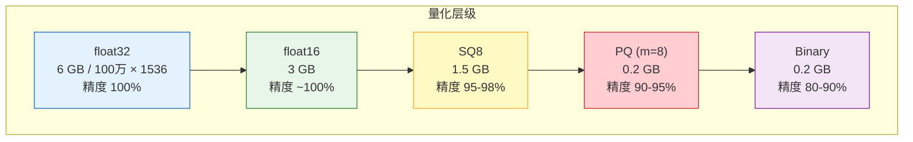
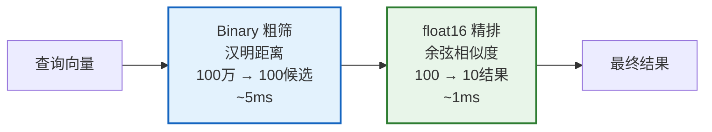

# 向量量化与索引压缩图解

> 通过降低精度压缩存储：float32 → float16 → SQ8 → PQ → Binary，精度换取内存和速度。

---

---

## 方法选择决策

| 文档量 | 推荐方法 | 内存 | 召回率 |
|--------|---------|------|--------|
| < 10万 | float16 | 0.3 GB | ~100% |
| 10万-100万 | SQ8 | 0.4-1.5 GB | 95-98% |
| 100万-1000万 | PQ | 0.1-0.5 GB | 90-95% |
| > 1000万 | Binary + float16 两阶段 | 0.2+1.5 GB | 85-95% |

---

## 两阶段搜索

---

## 检查清单

| 检查项 | 状态 |
|--------|------|
| 已评估内存需求 | ☐ |
| 已选择量化方法 | ☐ |
| 已评估召回率影响 | ☐ |
| 有两阶段搜索 | ☐ |
| 有量化前后基准 | ☐ |
| 有内存监控 | ☐ |
