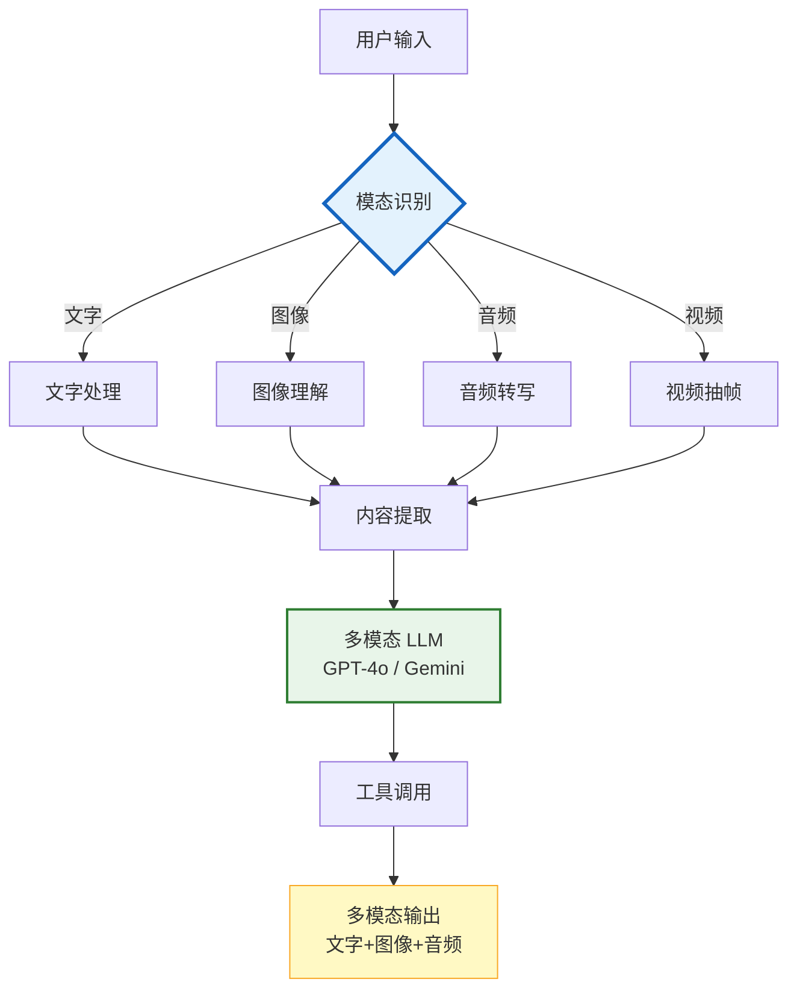

# 多模态 Agent 图解

> Agent 处理图像、音频、视频等多模态输入，综合理解后调用工具并返回多模态响应。

---



---

## 模型对比

| 模型 | 输入 | 输出 | 上下文 | 特点 |
|------|------|------|--------|------|
| GPT-4o | 文+图+音 | 文+音 | 128K | 全模态 |
| Claude 3.5 | 文+图 | 文 | 200K | 图像强 |
| Gemini 1.5 | 文+图+音+视频 | 文 | 2M | 支持视频 |

---

## Token 成本

```
图像 detail=low:  固定 85 Token（便宜）
图像 detail=high: 85 + 面积×170（一张图可达 765T）
音频:             按时长计费
视频:             每帧按图像计
```

---

## 检查清单

| 检查项 | 状态 |
|--------|------|
| 有模态识别 | ☐ |
| 有多模态消息 | ☐ |
| 有图像处理 | ☐ |
| 有音频转写 | ☐ |
| 有 Token 优化 | ☐ |
