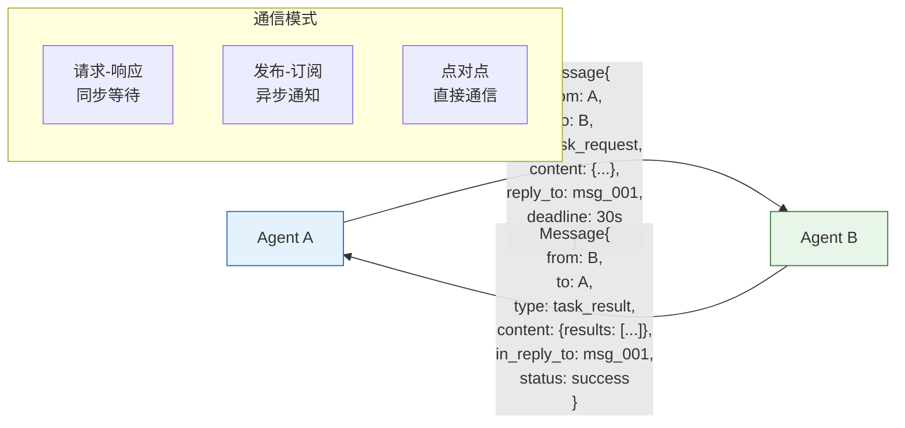

# Agent 通信协议图解

> 多 Agent 之间通过标准化消息格式通信：明确寻址、可追溯、有超时、有能力发现。

---



---

## 消息结构

| 字段 | 说明 | 示例 |
|------|------|------|
| id | 唯一标识 | msg_001 |
| from/to | 发送/接收者 | agent_a / agent_b |
| type | 消息类型 | task_request / task_result |
| content | 消息内容 | {"query": "..."} |
| reply_to | 关联消息 | msg_001 |
| deadline | 超时 | 30s |
| conversation_id | 对话追踪 | conv_001 |

---

## 能力发现

```mermaid
graph TB
    DISC["发现者"] -->|"握手请求"| A1["Agent 1"]
    DISC -->|"握手请求"| A2["Agent 2"]
    A1 -->|"能力: [搜索, 检索]"| DISC
    A2 -->|"能力: [分析, 报告]"| DISC
    DISC --> REG["能力注册表<br/>{agent1: [搜索], agent2: [分析]}"
    
    style DISC fill:#E3F2FD,stroke:#1565C0,stroke-width:2px
    style REG fill:#E8F5E9,stroke:#2E7D32
```

---

## 检查清单

| 检查项 | 状态 |
|--------|------|
| 有消息格式定义 | ☐ |
| 有 reply_to 追溯 | ☐ |
| 有超时处理 | ☐ |
| 有能力发现 | ☐ |
| 有心跳 | ☐ |
| 有消息日志 | ☐ |
