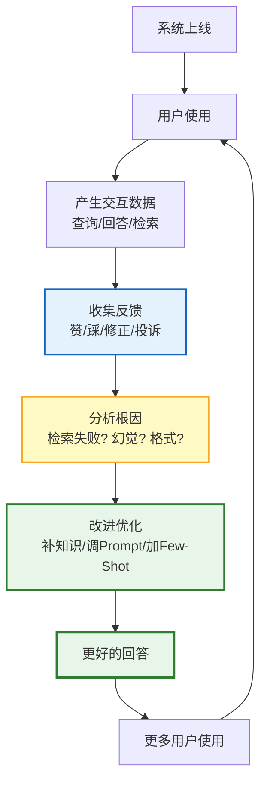

# 数据飞轮与持续学习图解

> 用户反馈 → 分析根因 → 改进优化 → 更好回答 → 更多用户 → 更多反馈，形成正向飞轮。

---

---

## 反馈类型与价值

| 反馈类型 | 价值 | 示例 |
|----------|------|------|
| 用户修正 | 最高 | 用户编辑了回答 |
| 显式反馈 | 高 | 点赞/踩 |
| 隐式反馈 | 中 | 复制/重新生成 |
| 专家标注 | 最高 | 人工审核 |
| AB对比 | 中高 | 灰度测试 |

---

## 运营节奏

| 频率 | 活动 | 输出 |
|------|------|------|
| 实时 | 收集反馈 | 反馈数据 |
| 每日 | 分析隐式信号 | 满意度趋势 |
| 每周 | 分析负面反馈 | 问题报告 |
| 每周 | 执行改进 | 部署更新 |
| 每月 | 评估集更新 | 质量基线 |

---

## 检查清单

| 检查项 | 状态 |
|--------|------|
| 有反馈收集入口 | ☐ |
| 有显式反馈 | ☐ |
| 有隐式反馈 | ☐ |
| 有根因分析 | ☐ |
| 有改进引擎 | ☐ |
| 有飞轮看板 | ☐ |
