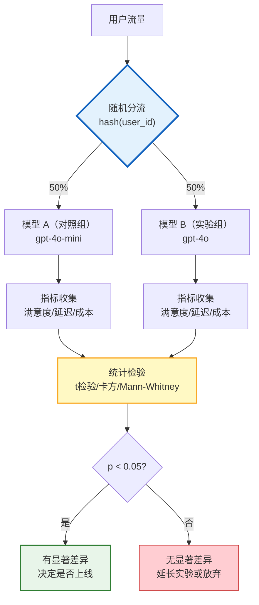

# 模型 AB 测试图解

> 科学对比两个模型版本：随机分流 → 收集指标 → 统计检验 → 数据说话。

---

---

## 检验方法选择

| 指标类型 | 检验方法 | 示例 |
|----------|---------|------|
| 连续型 | t 检验 | 延迟、Token 数 |
| 二元型 | 卡方检验 | 满意率、转化率 |
| 非正态 | Mann-Whitney | 评分分布 |

---

## 常见陷阱

| 陷阱 | 后果 | 解决 |
|------|------|------|
| 样本不足 | 假阴性 | 提前算样本量 |
| 一次改多 | 无法归因 | 只改一个变量 |
| 中途偷看 | 提前下结论 | 等到实验结束 |
| 新奇效应 | 初期偏好 | 等效应消退 |

---

## 检查清单

| 检查项 | 状态 |
|--------|------|
| 有样本量计算 | ☐ |
| 有确定性分流 | ☐ |
| 有统计检验 | ☐ |
| 有多指标对比 | ☐ |
| 有灰度发布 | ☐ |
| 有实验日志 | ☐ |
