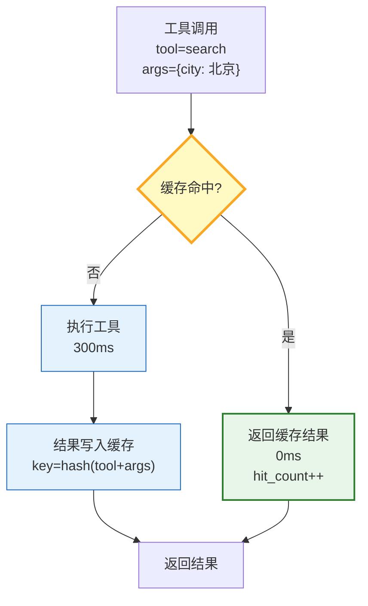
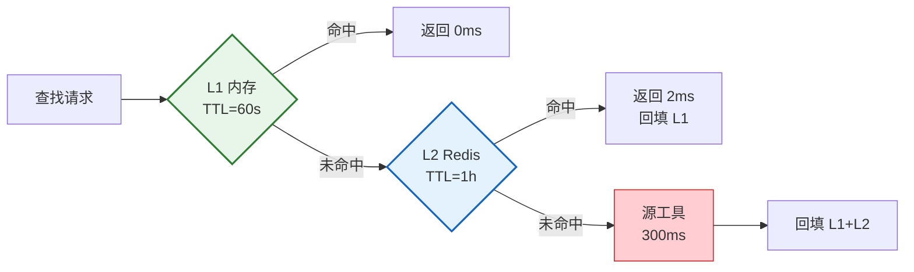

# Tool 缓存与工具结果复用图解

> 相同参数的工具调用直接返回缓存结果，延迟从秒级降到毫秒级。

---

---

## 缓存策略对比

| 策略 | 适用 | TTL | 示例 |
|------|------|-----|------|
| TTL 过期 | 数据变化慢 | 5min | 天气/汇率 |
| 事件触发 | 数据可变 | — | 数据库查询 |
| 永不缓存 | 结果不确定 | — | 代码执行 |
| LRU 淘汰 | 通用 | — | 控制内存 |

---

## 多级缓存

---

## 检查清单

| 检查项 | 状态 |
|--------|------|
| 有精确参数缓存 | ☐ |
| 有 TTL 过期 | ☐ |
| 有失效策略 | ☐ |
| 有不可缓存判断 | ☐ |
| 有命中率统计 | ☐ |
| 有缓存监控 | ☐ |
