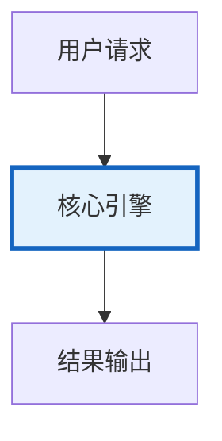

# Agent监控与可观测性图解

> Agent监控与可观测性图解的核心概念与流程。

---

## 概念图解

---

## 监控三支柱
| 指标 Metrics | 日志 Logs | 追踪 Traces |
| 数值聚合 | 事件记录 | 请求级全链路 |
| QPS/延迟 | 错误/调试 | span树+因果 |

## Agent 特有指标
| 延迟 | 多轮推理+多步工具调用 |
| 成本 | Token消耗+API费用 |
| 质量 | 语义正确（主观） |
| 链路 | LLM→工具→LLM→工具

---

## 检查清单

| 检查项 | 状态 |
|--------|------|
| 已理解核心概念 | ☐ |
| 已掌握关键流程 | ☐ |
| 对应知识库 417 | ☐ |
