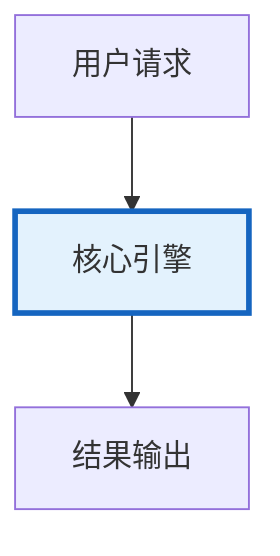

# 推理加速与批处理图解

> 推理加速与批处理图解的核心概念与流程。

---

## 概念图解

---

## 加速技术栈
| 请求层 | 批处理/语义缓存/并发 |
| 模型层 | KV Cache/推测解码 |
| 框架层 | vLLM/TGI/TensorRT |
| 硬件层 | GPU/量化/Flash Attention |

## 批处理效果
| 串行100请求 | ~200s |
| 批处理(batch=20) | ~10s |
| 批处理+并发 | ~2s |
| 加速比 | 10-50x

---

## 检查清单

| 检查项 | 状态 |
|--------|------|
| 已理解核心概念 | ☐ |
| 已掌握关键流程 | ☐ |
| 对应知识库 418 | ☐ |
