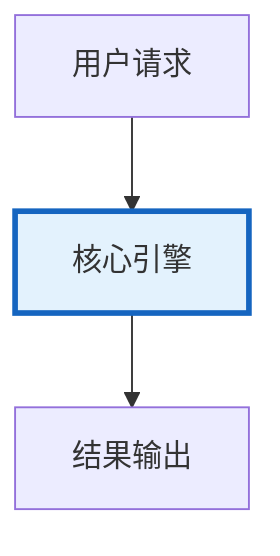

# 提示词版本管理图解

> 提示词版本管理图解的核心概念与流程。

---

## 概念图解

---

## 版本管理流程
注册 → 审核 → 测试 → 灰度 → 上线 → 回滚

## 版本生命周期
| draft | 草稿创建 |
| review | 提交审核 |
| active | 线上使用 |
| archived | 已归档 |
| rolled_back | 已回滚 |

## A/B 测试
| 版本A(50%) | 当前版本 |
| 版本B(50%) | 新版本 |
| 统计检验 | t检验/p值<0.05 |
| 结论 | 显著差异→上线

---

## 检查清单

| 检查项 | 状态 |
|--------|------|
| 已理解核心概念 | ☐ |
| 已掌握关键流程 | ☐ |
| 对应知识库 419 | ☐ |
