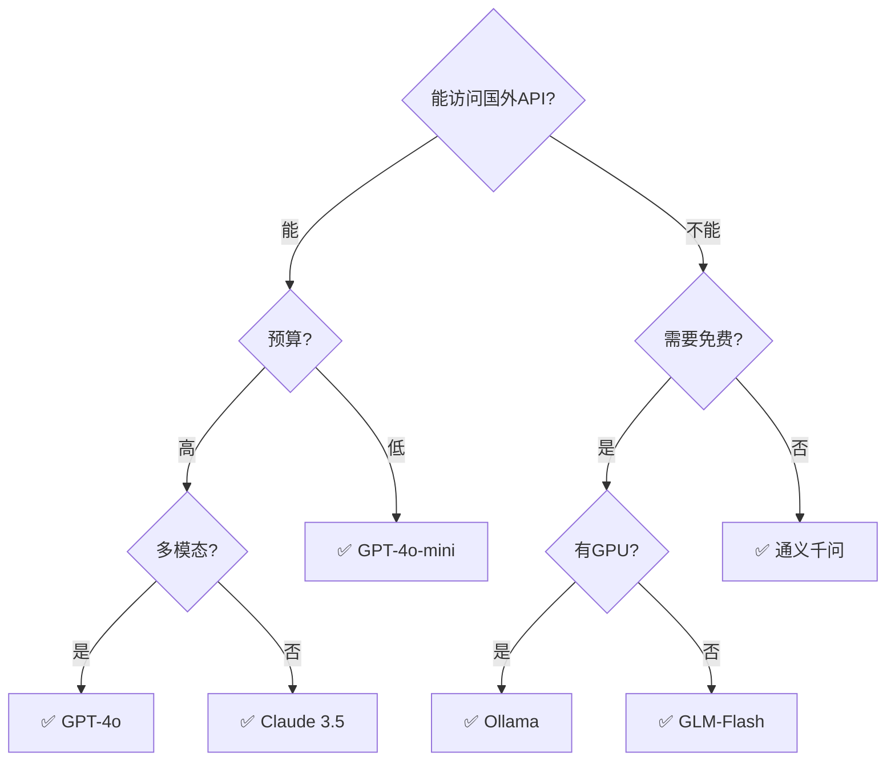

# 模型选型矩阵图解

> 用图解理解模型选型的六维度和决策流程。

---

## 一、选型六维度

```mermaid
graph TB
    subgraph 六维 {"模型选型六维度"}
        D1["质量<br/>推理/代码/多语言"]
        D2["速度<br/>延迟P50/P95"]
        D3["成本<br/>输入/输出单价"]
        D4["功能<br/>工具调用/多模态"]
        D5["隐私<br/>数据是否出国"]
        D6["稳定性<br/>可用率/限流"]
    end

    style D1 fill:'#C8E6C9'
    style D3 fill:'#FFE0B2'
    style D5 fill:'#FFCDD2'
```

## 二、模型对比雷达

```mermaid
graph TB
    subgraph 对比 {"主流模型定位"}
        G4["GPT-4o: 高质高价全能<br/>质量★★★★★ 成本★★★"]
        GM["GPT-4o-mini: 性价比之王<br/>质量★★★★ 成本★☆☆"]
        QW["通义千问: 中文+国内<br/>质量★★★★ 成本★★ 国内✅"]
        GLM["GLM-Flash: 免费入门<br/>质量★★★ 成本☆☆☆"]
        OLL["Ollama: 本地隐私<br/>质量★★★★ 成本☆ 隐私✅"]
        DS["DeepSeek: 代码强+便宜<br/>质量★★★★ 成本★"]
    end

    style GM fill:'#C8E6C9'
    style OLL fill:'#E3F2FD'
    style GLM fill:'#C8E6C9'
```

## 三、决策流程



## 四、成本对比

```mermaid
graph TB
    subgraph 月度成本 {"1000次/天 月度成本估算"}
        G4C["GPT-4o: ~$50/月"]
        GMC["GPT-4o-mini: ~$3/月"]
        QWC["通义千问plus: ~$8/月"]
        DSC["DeepSeek: ~$2/月"]
        GLMC["GLM-Flash: $0/月"]
        OLLC["Ollama: $0(电费)"]
    end

    style GLMC fill:'#C8E6C9'
    style OLLC fill:'#C8E6C9'
    style GMC fill:'#C8E6C9'
    style G4C fill:'#FFE0B2'
```
