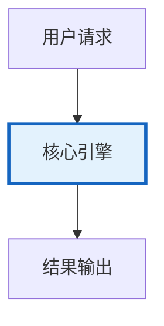

# Agent注册中心与服务发现图解

> Agent注册中心与服务发现图解的核心概念与流程。

---

## 概念图解

---

## 服务发现流程
Agent启动 → 注册到Registry → 定时心跳 → 调用方查询 → 负载均衡选择 → 调用

## 负载均衡策略
| 轮询 | 依次选择 |
| 最少负载 | 选load最低 |
| 加权 | 按权重选择 |
| 一致性哈希 | 同key同Agent |

## 健康检查
| 心跳间隔 | 10s |
| 超时 | 30s标记OFFLINE |
| 排空 | DRAINING不接新请求

---

## 检查清单

| 检查项 | 状态 |
|--------|------|
| 已理解核心概念 | ☐ |
| 已掌握关键流程 | ☐ |
| 对应知识库 420 | ☐ |
