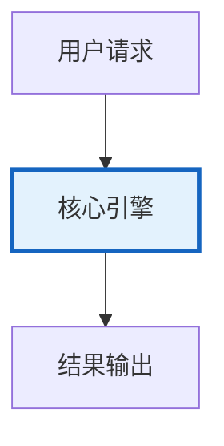

# 对话编排与多轮状态管理图解

> 对话编排与多轮状态管理图解的核心概念与流程。

---

## 概念图解

---

## 对话编排流程
用户输入 → 意图识别 → 槽位填充 → 工具执行 → 生成回复

## 对话状态
| 对话历史 | 当前会话 |
| 用户画像 | 跨会话 |
| 任务状态 | 任务期间 |
| 槽位状态 | 已收集信息 |
| 话题上下文 | 当前话题 |

## 上下文窗口管理
保留最近6-10条 + 旧消息摘要 → 适应Token限制

---

## 检查清单

| 检查项 | 状态 |
|--------|------|
| 已理解核心概念 | ☐ |
| 已掌握关键流程 | ☐ |
| 对应知识库 421 | ☐ |
