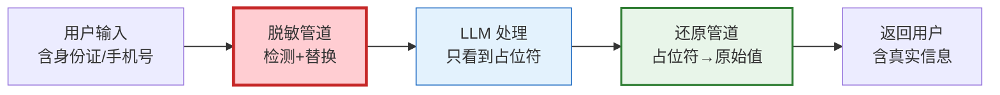

# 数据脱敏管道与隐私保护图解

> 敏感信息在进入 LLM 前替换为占位符，返回后还原，LLM 全程不接触真实敏感数据。

---

---

## 脱敏方式

| 方式 | 示例 | 适用 |
|------|------|------|
| 完全替换 | 13800138000→[PHONE_001] | LLM交互 |
| 部分掩码 | 138****8000 | UI展示 |
| 哈希脱敏 | sha256(phone) | 日志记录 |
| 泛化 | 北京市朝阳区 | 统计分析 |

---

## 检查清单

| 检查项 | 状态 |
|--------|------|
| 有敏感检测 | ☐ |
| 有脱敏+还原 | ☐ |
| 有LLM中间件 | ☐ |
| 有审计日志 | ☐ |
