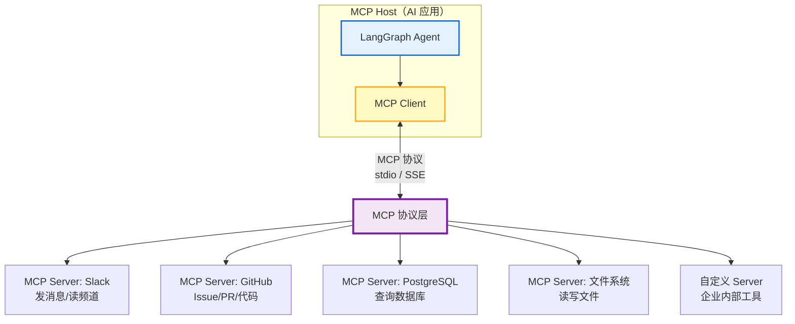
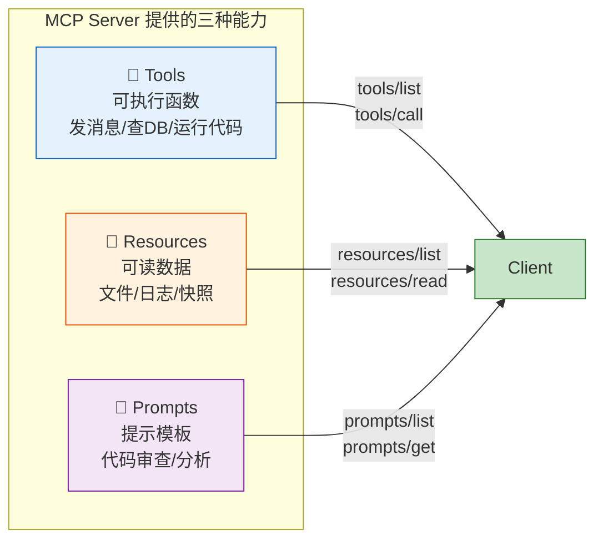
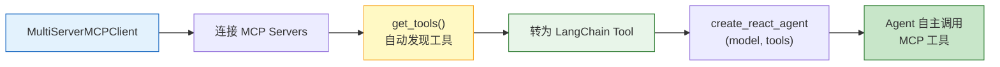
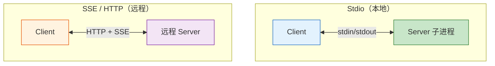
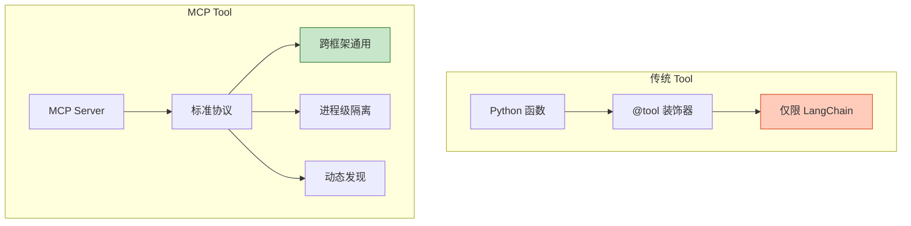
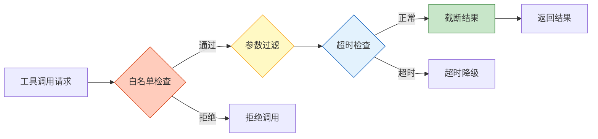

# MCP 协议与 LangChain 工具集成图解

> MCP（Model Context Protocol）是 AI 工具的 USB-C：一个协议连接所有工具和数据源。本图解可视化 MCP 架构与 LangChain 集成方式。

---

## MCP 整体架构

---

## 三大原语

---

## LangChain 集成流程

---

## 传输方式对比

| 维度 | Stdio | SSE/HTTP |
|------|-------|----------|
| 部署 | 本机 | 远程 |
| 配置 | 零配置 | 需 URL + 认证 |
| 延迟 | 极低 | 网络延迟 |
| 扩展性 | 单机 | 可分布式 |
| 安全 | 进程隔离 | 需额外认证 |

---

## MCP vs 传统 Tool

---

## 安全策略

---

## 检查清单

| 检查项 | 状态 |
|--------|------|
| 理解 MCP 三大原语 | ☐ |
| 能用 MultiServerMCPClient | ☐ |
| 在 LangGraph Agent 中使用 MCP | ☐ |
| 能自建 MCP Server | ☐ |
| 理解传输方式选择 | ☐ |
| 配置了安全策略 | ☐ |
| 了解 MCP vs 传统 Tool | ☐ |
| 会用 MCP Inspector 调试 | ☐ |
