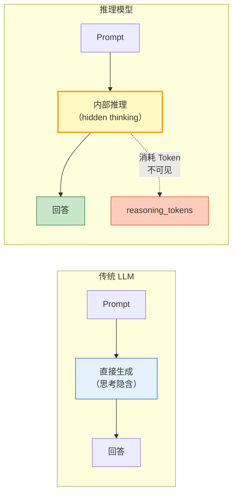
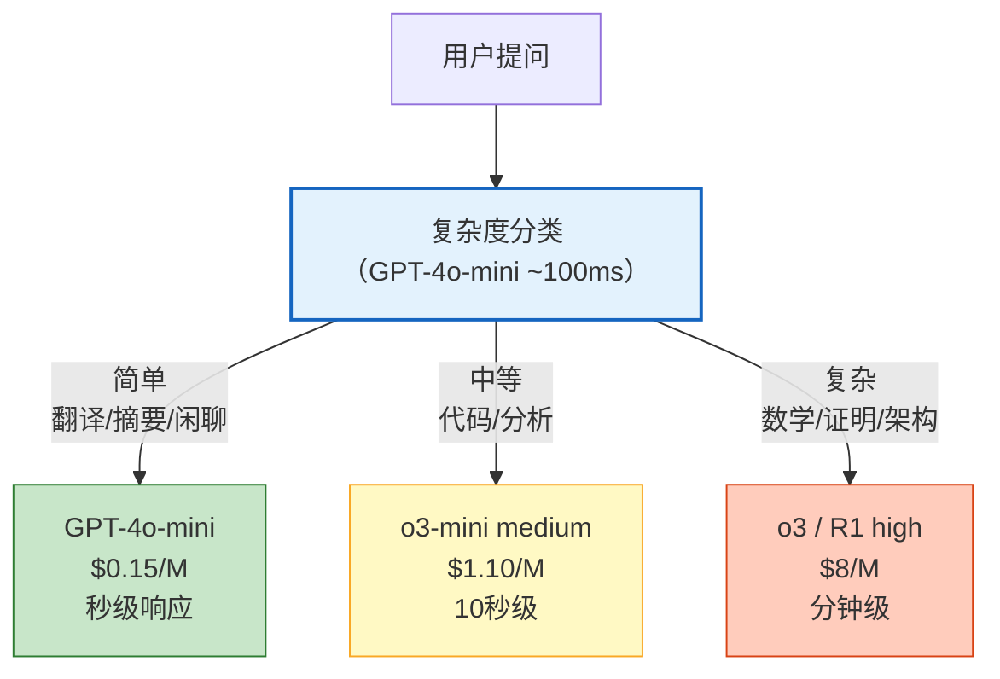
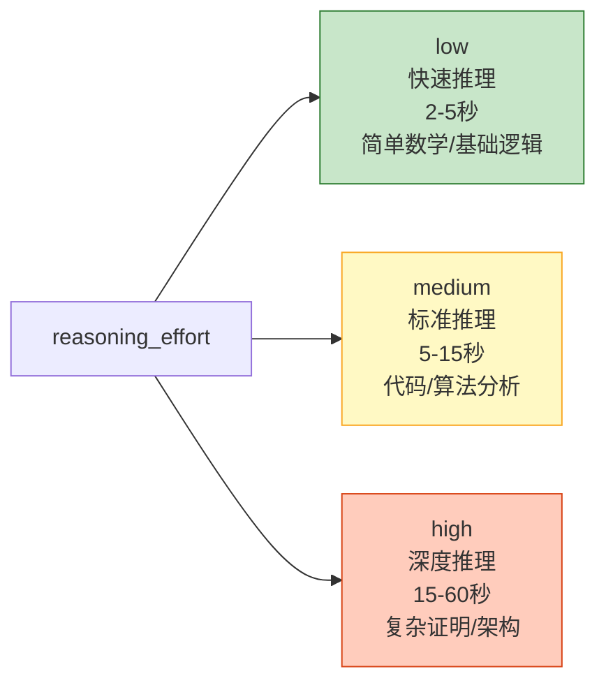
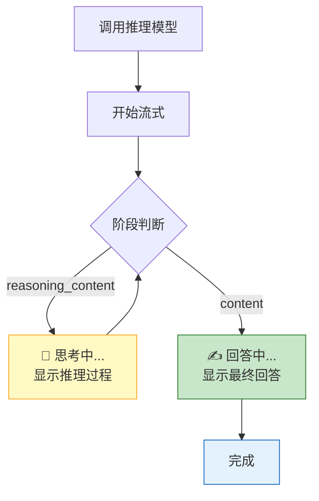
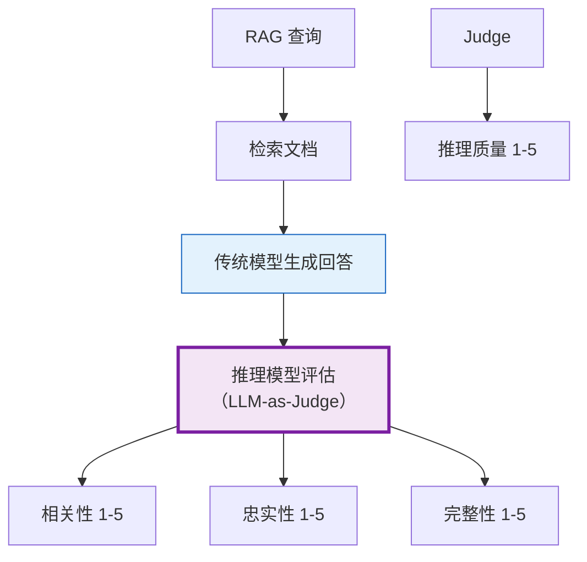
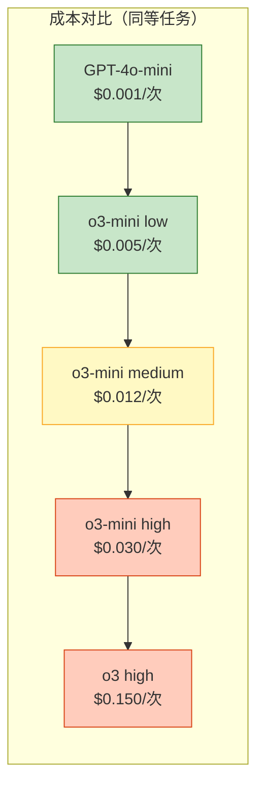

# 推理模型与 Agent 集成图解

> 推理模型在回答前先"想"再"说"，擅长复杂推理。本图解可视化推理模型与传统 LLM 的差异、混合模型路由和成本管理。

---

## 推理模型 vs 传统 LLM

---

## 混合模型路由

---

## reasoning_effort 选择

---

## 思考过程可视化

---

## 推理模型 + RAG 评估

---

## 成本对比

---

## 检查清单

| 检查项 | 状态 |
|--------|------|
| 理解推理模型差异 | ☐ |
| 能调用 o3-mini / R1 | ☐ |
| 实现混合模型路由 | ☐ |
| LangGraph Agent 集成 | ☐ |
| 能展示思考过程 | ☐ |
| reasoning_effort 调优 | ☐ |
| 成本追踪 | ☐ |
| 超时与降级处理 | ☐ |
