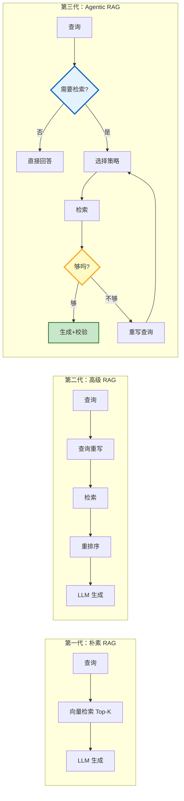
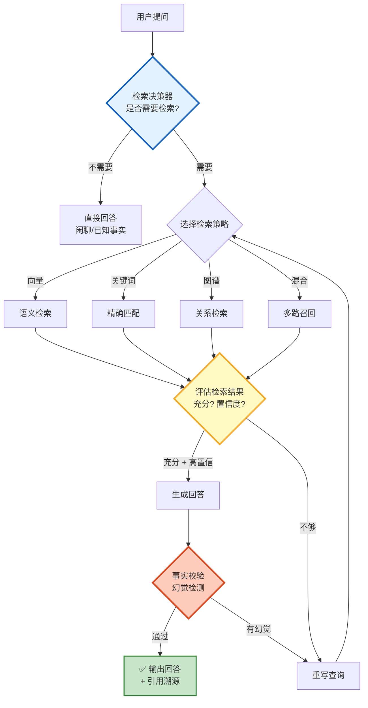
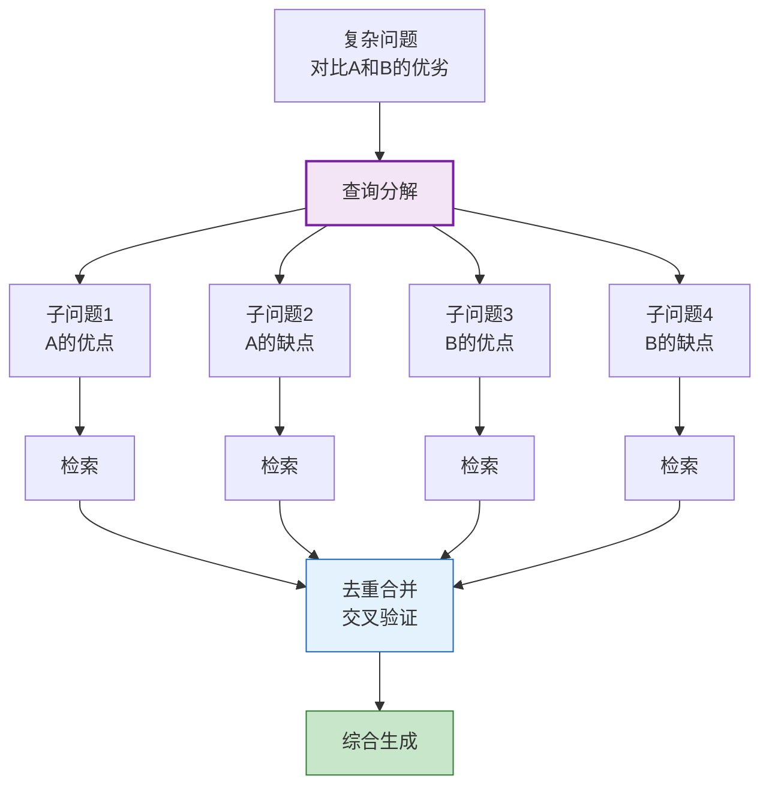
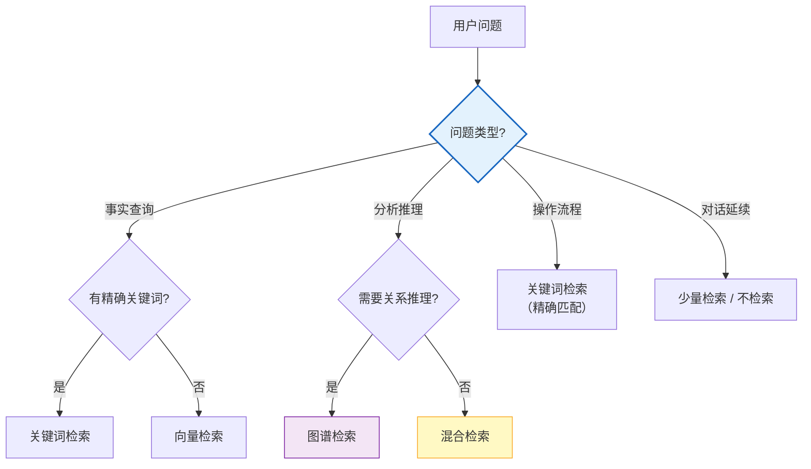

# Agentic RAG 与自适应检索决策图解

> 传统 RAG 固定流程检索一次就生成。Agentic RAG 让 Agent 自主决策：要不要检索、查什么、够不够、要不要再查一轮。本图解可视化 Agentic RAG 全流程。

---

## 三代 RAG 演进

---

## Agentic RAG 完整流程

---

## 查询分解与多跳检索

---

## 检索策略选择决策树

---

## Agentic RAG vs 传统 RAG 对比

| 维度 | 传统 RAG | Agentic RAG |
|------|----------|-------------|
| 检索次数 | 固定 1 次 | 1-3 次（自适应） |
| 检索策略 | 固定向量 | 动态选择 |
| 结果评估 | 无 | LLM 评估充分性 |
| 查询重写 | 无 | 自动重写 |
| 幻觉检测 | 无 | 事实校验 |
| LLM 调用 | 1 次 | 3-8 次 |
| 准确率 | ~70% | ~90% |
| 幻觉率 | ~15% | ~5% |
| 成本 | $0.001-0.01 | $0.005-0.05 |

---

## 检查清单

| 检查项 | 状态 |
|--------|------|
| 理解三代 RAG 演进 | ☐ |
| 实现检索决策器 | ☐ |
| LangGraph 迭代检索循环 | ☐ |
| 检索结果评估节点 | ☐ |
| 查询重写/分解 | ☐ |
| 最大检索轮数限制 | ☐ |
| 事实校验/幻觉检测 | ☐ |
| 多源交叉验证 | ☐ |
| 成本优化策略 | ☐ |
