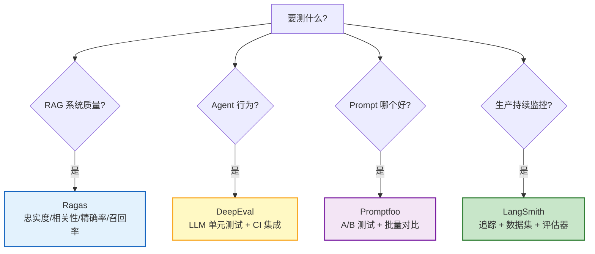
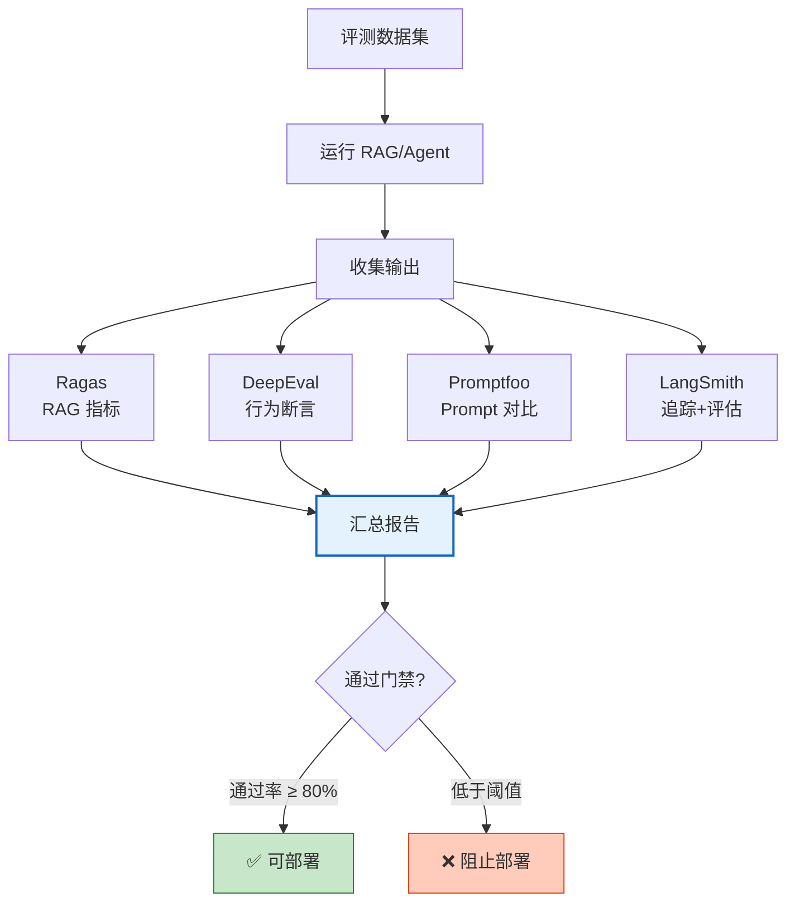
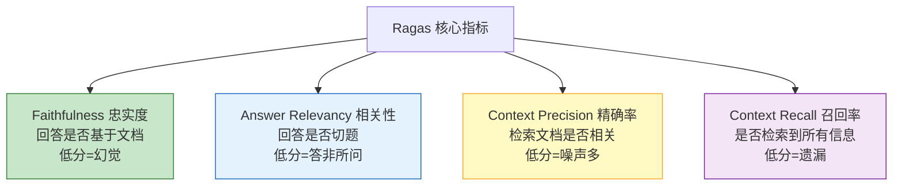
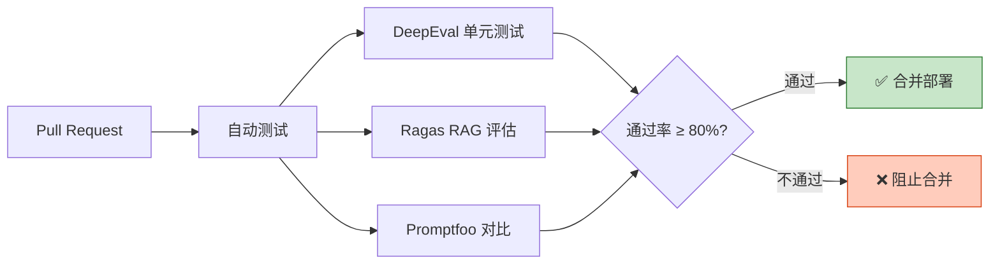

# LLM 评测工具链集成图解

> "感觉好一点"不靠谱。本图解可视化 DeepEval、Ragas、Promptfoo、LangSmith 四大评测工具的定位和组合方案。

---

## 四大工具定位

---

## 组合评测流水线

---

## Ragas 四大指标

---

## CI/CD 集成

---

## 指标优化方向

| 指标低分 | 可能原因 | 优化方向 |
|---------|---------|---------|
| 忠实度低 | 幻觉/编造 | Prompt 约束 + 事实校验 |
| 相关性低 | 答非所问 | 查询理解 + 上下文组装 |
| 精确率低 | 检索噪声 | 重排序 + 调 Top-K |
| 召回率低 | 信息遗漏 | 增加分块 + 混合检索 |

---

## 检查清单

| 检查项 | 状态 |
|--------|------|
| 理解四大工具定位 | ☐ |
| DeepEval 单元测试 | ☐ |
| Ragas RAG 评估 | ☐ |
| Promptfoo A/B 测试 | ☐ |
| LangSmith 数据集管理 | ☐ |
| 组合评测方案 | ☐ |
| CI/CD 门禁集成 | ☐ |
