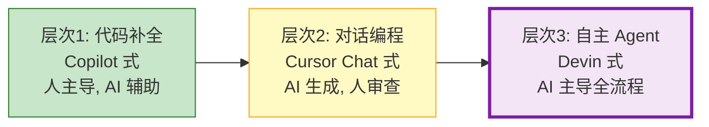
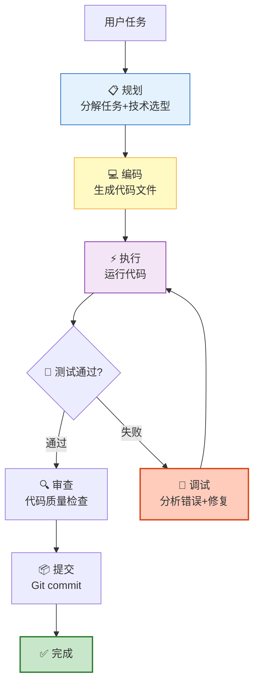
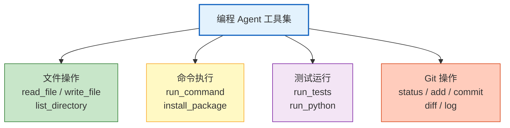
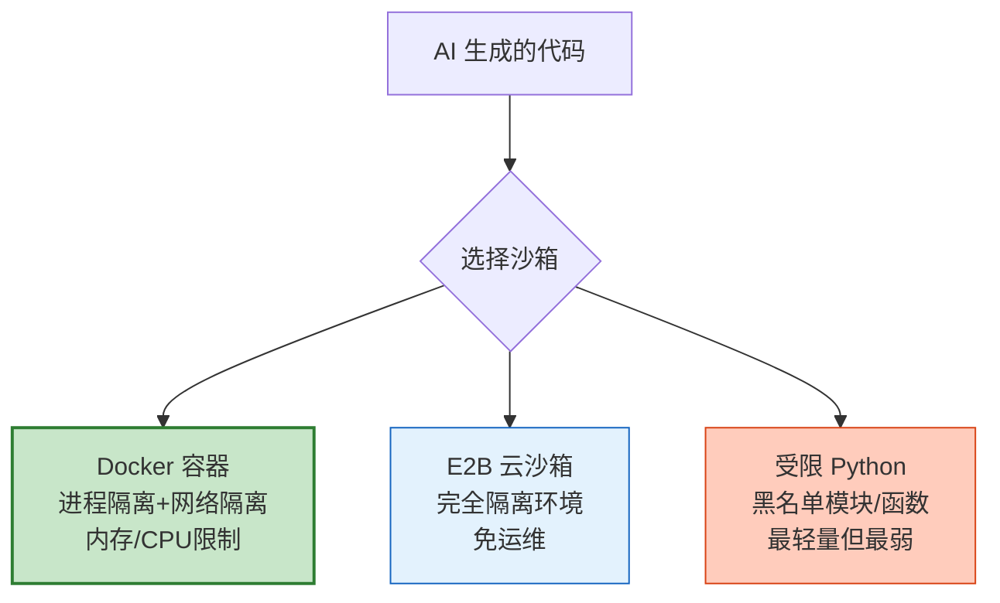
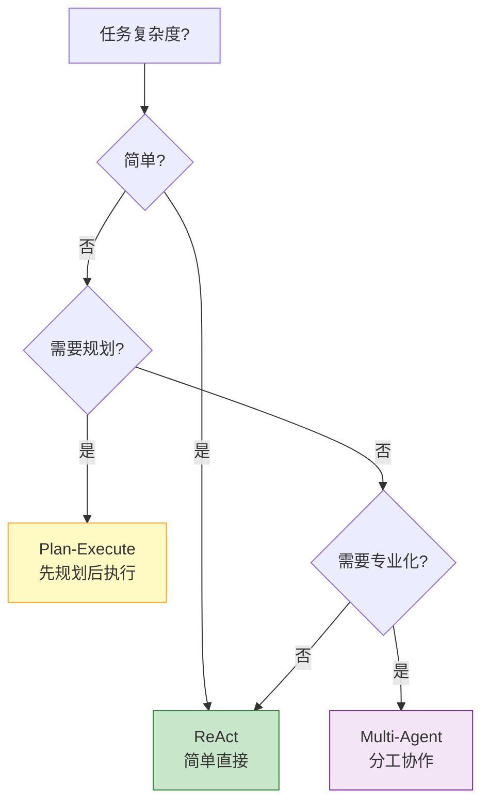
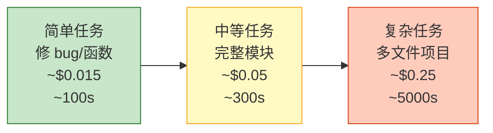

# AI 编程 Agent 与代码自动化图解

> 从代码补全到自主编程——AI 编程 Agent 的工作循环、架构设计和安全沙箱。本图解可视化完整链路。

---

## 三个层次

---

## 工作循环

---

## 核心工具集

---

## 沙箱隔离方案

---

## Agent 架构对比

---

## 能力对比

| 能力 | 补全式 | 对话式 | Agent 式 |
|------|--------|--------|---------|
| 生成范围 | 单行/函数 | 整文件 | 多文件/项目 |
| 运行代码 | ❌ | ❌ | ✅ |
| 自主调试 | ❌ | 有限 | ✅ |
| 写+跑测试 | ❌ | ✅ | ✅ |
| Git 操作 | ❌ | ❌ | ✅ |
| 自主规划 | ❌ | ❌ | ✅ |

---

## 成本对比

---

## 检查清单

| 检查项 | 状态 |
|--------|------|
| 理解三个层次 | ☐ |
| 核心工具集实现 | ☐ |
| 规划-编码-测试-调试循环 | ☐ |
| 代码沙箱配置 | ☐ |
| 代码审查功能 | ☐ |
| 架构选型理解 | ☐ |
| 成本模型理解 | ☐ |
| 安全风险处理 | ☐ |
