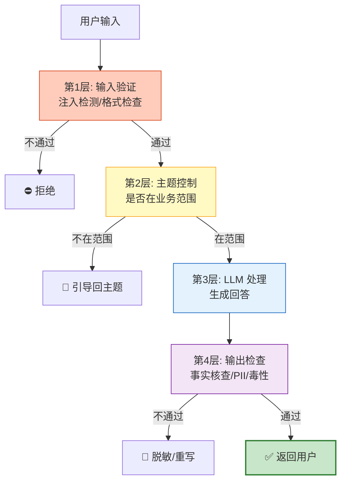
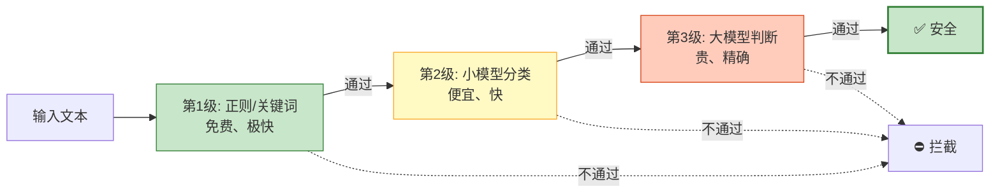

# NeMo Guardrails 与 Agent 护栏系统图解

> 输入检查、输出脱敏、主题控制、越狱防护——Guardrails 是 LLM 的安全带。本图解可视化四层防护体系和分级策略。

---

## 四层防护体系

---

## 分级护栏策略

---

## 护栏类型对照

| 护栏 | 位置 | 检查内容 | 不通过处理 |
|------|------|---------|-----------|
| 注入防护 | 输入 | Prompt注入检测 | 拒绝 |
| 主题控制 | 输入 | 业务范围检查 | 引导 |
| PII检测 | 输入 | 敏感信息输入 | 脱敏/拒绝 |
| 事实核查 | 输出 | 回答是否基于文档 | 标注/重写 |
| 毒性检测 | 输出 | 有害内容检测 | 拒绝 |
| PII脱敏 | 输出 | 敏感信息输出 | 脱敏 |

---

## 检查清单

| 检查项 | 状态 |
|--------|------|
| 理解四层防护体系 | ☐ |
| NeMo Guardrails 配置 | ☐ |
| 输入护栏实现 | ☐ |
| 输出护栏实现 | ☐ |
| LangGraph 集成 | ☐ |
| 分级护栏策略 | ☐ |
