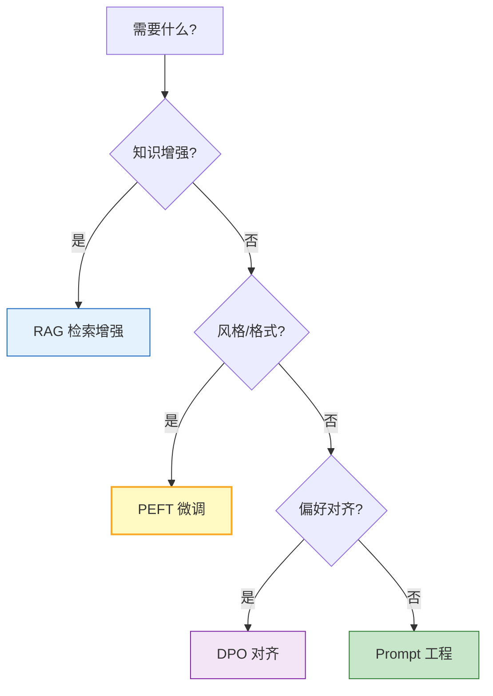
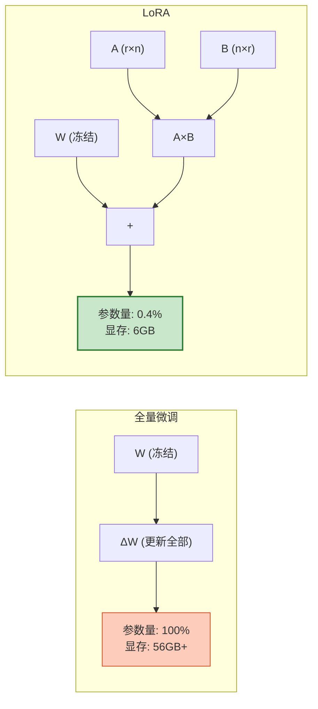
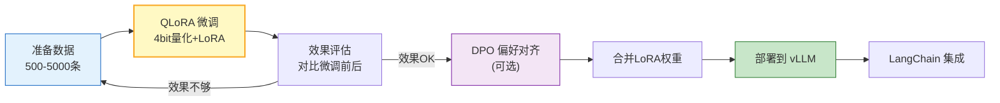
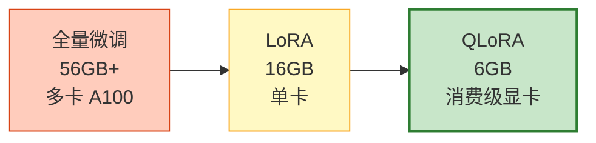

# PEFT 微调与 DPO 对齐实践图解

> LoRA 用 1% 参数达到 95% 效果，DPO 不需要奖励模型就能对齐偏好。本图解可视化微调流程和选型决策。

---

## 增强方式选型

---

## LoRA 原理

---

## 微调流程

---

## DPO vs RLHF

| 维度 | RLHF | DPO |
|------|------|-----|
| 奖励模型 | 需要 | 不需要 |
| 强化学习 | PPO | 无 |
| 复杂度 | 高 | 低 |
| 稳定性 | 差 | 好 |
| 效果 | 好 | 接近 |

---

## 显存对比（7B 模型）

---

## 检查清单

| 检查项 | 状态 |
|--------|------|
| 理解微调 vs Prompt vs RAG | ☐ |
| 理解 LoRA/QLoRA 原理 | ☐ |
| QLoRA 微调实战 | ☐ |
| DPO 偏好对齐 | ☐ |
| 微调模型部署到 vLLM | ☐ |
| LangChain 集成微调模型 | ☐ |
