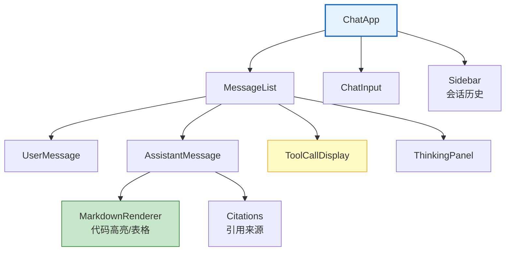
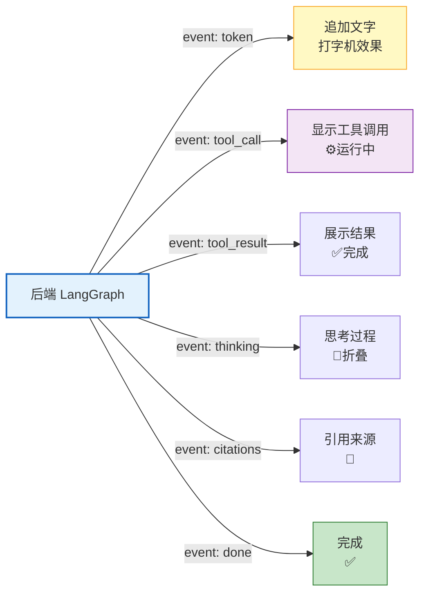
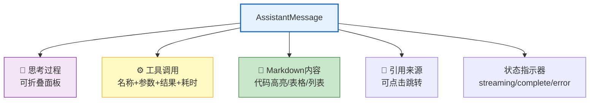

# Agent 前端与聊天 UI 构建图解

> 流式打字机、工具调用状态、思考过程折叠、引用来源展示——聊天 UI 的每个细节都影响用户体验。本图解可视化前端架构和组件层次。

---

## 前端组件层次

---

## SSE 事件流

---

## 消息渲染

---

## 体验优化要点

| 优化点 | 说明 |
|--------|------|
| 首 Token < 500ms | 用户感知响应速度 |
| 打字机 30fps+ | 流式渲染流畅 |
| 工具调用实时展示 | 透明度+信任感 |
| 自动滚动+暂停 | 滚到底部/手动暂停 |
| 断线重连 | 指数退避重试 |
| Markdown 渲染 | 代码高亮/表格 |
| 可中断 | 停止生成按钮 |
| 快捷键 | Enter发送/Shift+Enter换行 |

---

## 检查清单

| 检查项 | 状态 |
|--------|------|
| SSE 流式接收 | ☐ |
| 打字机效果 | ☐ |
| 工具调用可视化 | ☐ |
| Markdown 渲染 | ☐ |
| 引用来源展示 | ☐ |
| 思考过程折叠 | ☐ |
| 自动滚动 | ☐ |
| 断线重连 | ☐ |
| 后端 SSE 端点 | ☐ |
