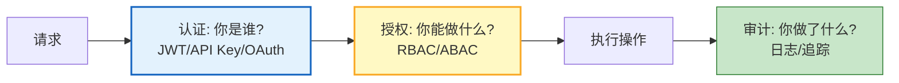
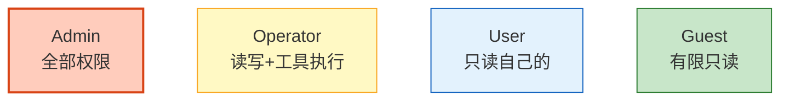
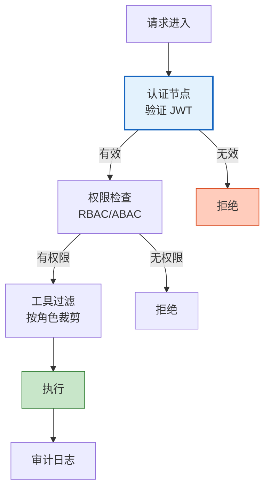
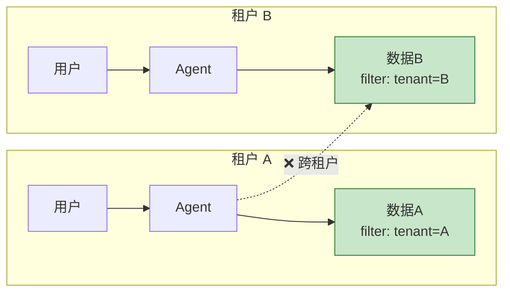

# Agent 身份认证与授权体系图解

> Agent 不能匿名操作，也不能拥有无限权限。本图解可视化认证、授权、审计三道防线和 RBAC/ABAC 模型。

---

## 三道防线

---

## RBAC 角色权限

---

## LangGraph 认证流程

---

## 多租户隔离

---

## 检查清单

| 检查项 | 状态 |
|--------|------|
| 理解认证/授权/审计 | ☐ |
| JWT 认证实现 | ☐ |
| RBAC 角色权限 | ☐ |
| ABAC 属性级授权 | ☐ |
| LangGraph 认证节点 | ☐ |
| 动态工具过滤 | ☐ |
| 多租户隔离 | ☐ |
| 审计日志 | ☐ |
