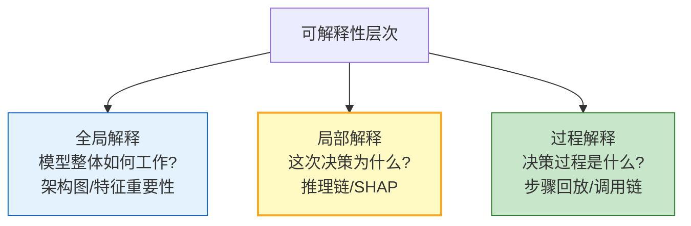
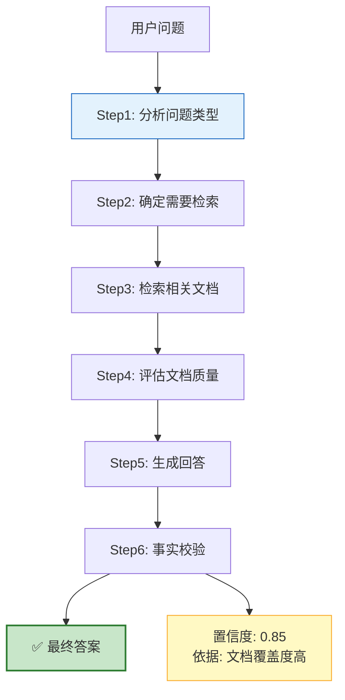
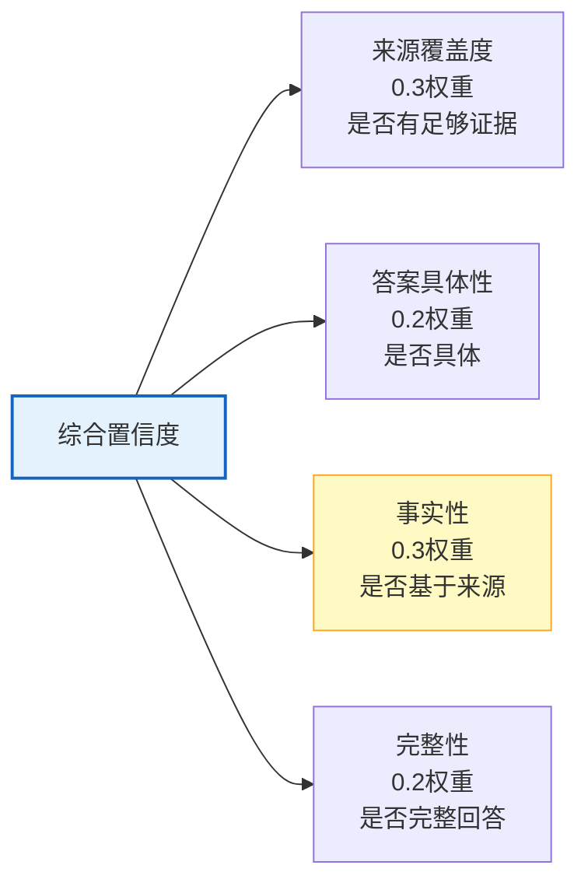
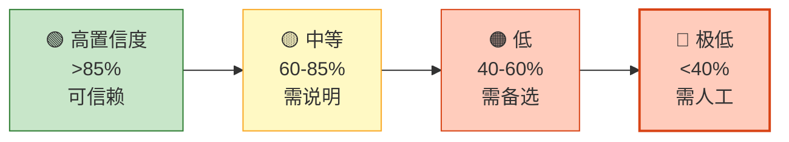

# Agent 可解释性与 XAI 图解

> "为什么 AI 做了这个决定？"——可解释性让决策过程透明可审计。本图解可视化推理链、置信度评分和审计报告。

---

## 三个层次

---

## 推理链展示

---

## 置信度评分维度

---

## 置信度展示

---

## 审计报告结构

| 章节 | 内容 |
|------|------|
| 基本信息 | 时间/用户/查询 |
| 推理步骤 | 逐步思考过程 |
| 工具使用 | 工具名+选择理由 |
| 结果 | 答案+置信度 |
| 评估 | 完整性/合理性 |
| 审计结论 | 可信赖/需审查 |

---

## 检查清单

| 检查项 | 状态 |
|--------|------|
| 理解三个层次 | ☐ |
| 推理链展示 | ☐ |
| 多维度置信度 | ☐ |
| 工具选择解释 | ☐ |
| LangSmith 追踪 | ☐ |
| 审计报告 | ☐ |
