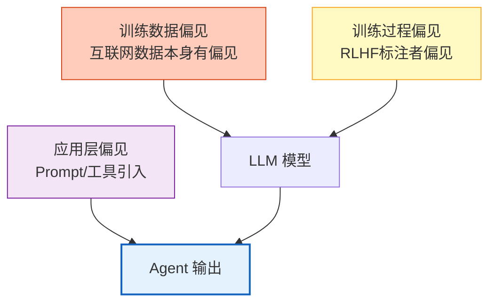
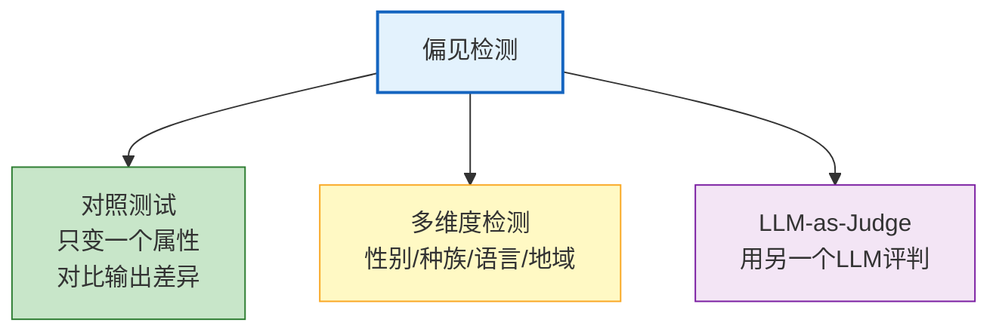
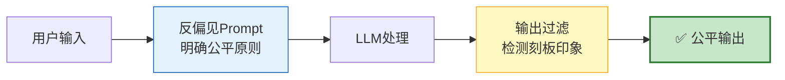

# AI 伦理与偏见检测图解

> LLM 不是中立的——训练数据中的偏见会被模型吸收并放大。本图解可视化偏见来源、检测方法和缓解策略。

---

## 偏见三层来源

---

## 偏见检测方法

---

## 缓解策略

---

## AI 伦理七原则

| 原则 | 要求 | 实现 |
|------|------|------|
| 公平性 | 不歧视 | 偏见检测 |
| 透明性 | 可解释 | 推理链 |
| 隐私保护 | 不泄露 | PII脱敏 |
| 安全性 | 无害 | 输出护栏 |
| 可问责 | 可追溯 | 审计日志 |
| 人类控制 | 可介入 | Human-in-loop |
| 社会福祉 | 不损害 | 价值对齐 |

---

## 检查清单

| 检查项 | 状态 |
|--------|------|
| 理解偏见三层来源 | ☐ |
| 对照测试法 | ☐ |
| 多维度偏见检测 | ☐ |
| 反偏见 Prompt | ☐ |
| 输出偏见过滤 | ☐ |
| 公平性持续监控 | ☐ |
