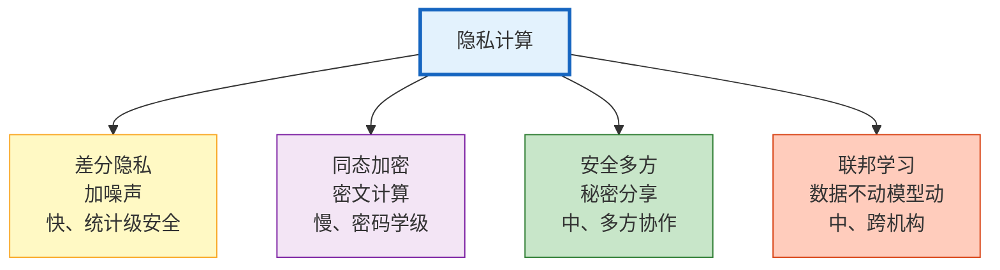
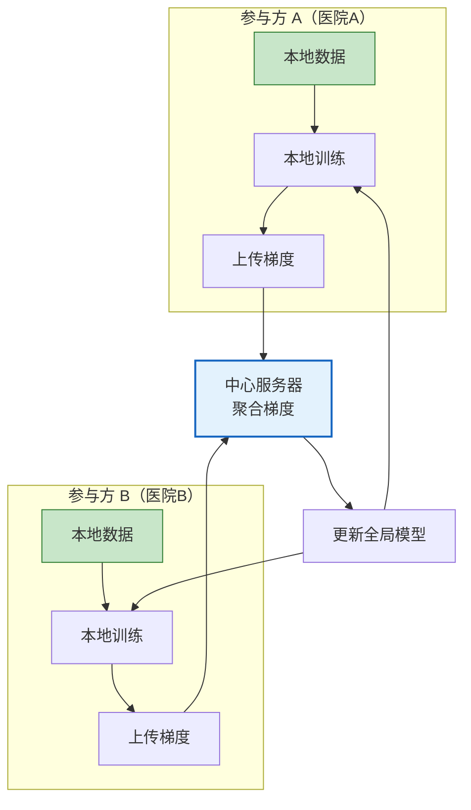
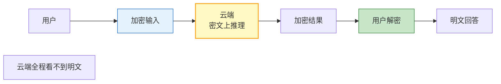
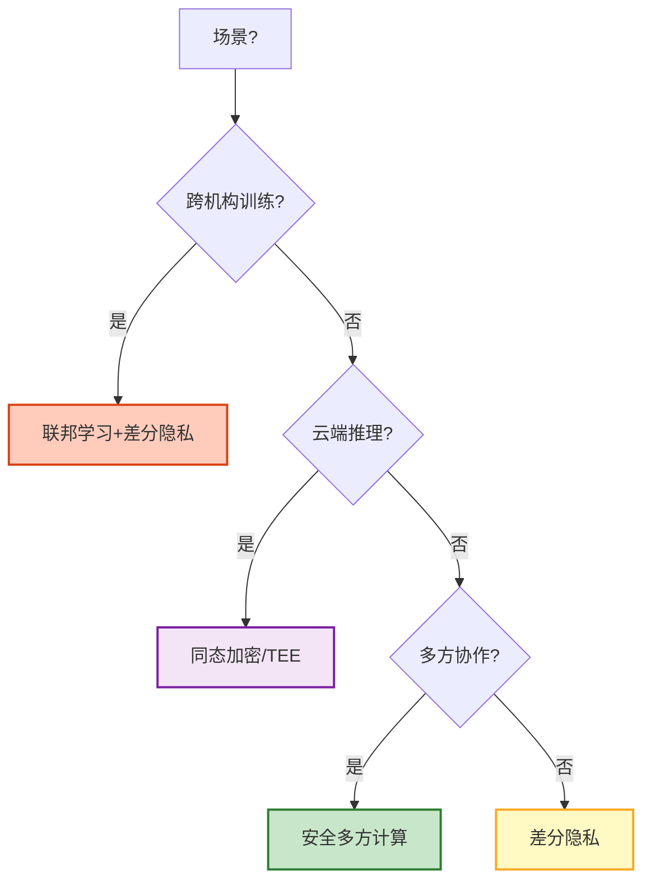

# 隐私计算与联邦学习图解

> 数据可用不可见——隐私计算让多方在不泄露原始数据的前提下共同训练或推理。本图解可视化四大技术路线。

---

## 四大技术路线

---

## 联邦学习原理

---

## 同态加密推理

---

## 技术对比

| 技术 | 安全性 | 性能 | 适用 |
|------|--------|------|------|
| 差分隐私 | 统计级 | 快 | 数据发布 |
| 同态加密 | 密码学级 | 慢 | 云端推理 |
| 安全多方 | 密码学级 | 中 | 联合建模 |
| 联邦学习 | 取决协议 | 中 | 跨机构 |
| 可信执行 | 硬件级 | 快 | 云端推理 |

---

## 场景选型

---

## 检查清单

| 检查项 | 状态 |
|--------|------|
| 理解四大技术 | ☐ |
| 差分隐私 ε/δ | ☐ |
| 同态加密原理 | ☐ |
| 联邦学习流程 | ☐ |
| 场景选型 | ☐ |
