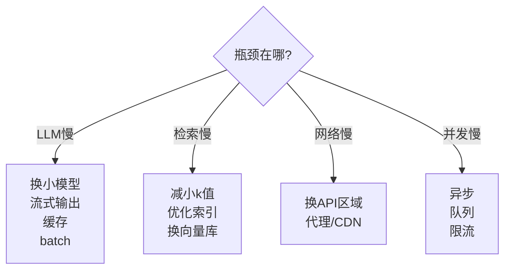

# 性能剖析图解

> 用图解理解 LLM 应用的性能瓶颈分布和优化策略。

---

## 一、瓶颈分布

```mermaid
graph TB
    subgraph 瓶颈 {"LLM应用延迟构成"}
        LLM["LLM API调用<br/>60-80% 🔴"]
        RET["向量检索<br/>10-20% 🟡"]
        NET["网络传输<br/>5-10% 🟢"]
        SER["序列化/解析<br/>2-5% 🟢"]
    end

    style LLM fill:'#FFCDD2'
    style RET fill:'#FFE0B2'
    style NET fill:'#FFF9C4'
    style SER fill:'#C8E6C9'
```

## 二、分层剖析

```mermaid
graph TB
    subgraph 剖析 {"从外到内逐层剖析"}
        L1["Layer 1: 端到端延迟<br/>总耗时"] --> L2["Layer 2: Chain各步骤<br/>prompt→llm→parser"]
        L2 --> L3["Layer 3: LLM调用<br/>API延迟+Token"]
        L3 --> L4["Layer 4: 检索<br/>向量库查询"]
    end

    style L1 fill:'#FFCDD2'
    style L4 fill:'#C8E6C9'
```

## 三、剖析结果示例

```
=== 性能剖析报告 ===
  PromptTemplate: 0.001s (0%)
  LLM: 2.847s (93%) | 1850 tokens  ← 瓶颈
  StrOutputParser: 0.000s (0%)
  总计: 2.848s
```

## 四、优化策略映射



## 五、优化效果对比

| 优化策略 | 延迟降低 | 难度 | 适用 |
|---------|---------|------|------|
| 换小模型 | 50-70% | ★☆☆ | LLM瓶颈 |
| 流式输出 | 首字90% | ★☆☆ | 体验优化 |
| 缓存 | 命中100% | ★★☆ | 重复调用 |
| batch | 并发60% | ★★☆ | 多请求 |
| 减k值 | 检索30-50% | ★☆☆ | 检索瓶颈 |
| 截断历史 | Token40% | ★★☆ | 长对话 |
