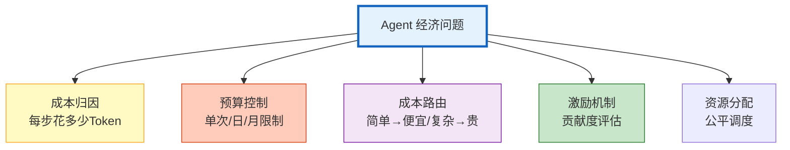

# Agent 经济模型与激励机制图解

> Token 是 AI 时代的"燃料"——怎么花、花在哪、怎么控制预算？本图解可视化 Token 经济学和成本感知路由。

---

## Token 经济学



---

## 成本感知路由

```mermaid
graph TB
    Q["用户请求"] --> CLS["快速分类<br/>GPT-4o-mini<br/>~$0.0001"]
    CLS --> SIMPLE{"简单?"}
    SIMPLE -->|"是"| MINI["GPT-4o-mini<br/>$0.001/次"]
    SIMPLE -->|"否"| MOD{"中等?"}
    MOD -->|"是"| G4["GPT-4o<br/>$0.01/次"]
    MOD -->|"否"| O3["o3-mini<br/>$0.03/次"]
    MINI --> BUDGET{"预算检查"}
    G4 --> BUDGET
    O3 --> BUDGET
    BUDGET -->|"OK"| EXEC["执行"]
    BUDGET -->"不足"| FALLBACK["降级到便宜模型"]

    style CLS fill:#C8E6C9,stroke:#2E7D32
    style MINI fill:#C8E6C9,stroke:#2E7D32,stroke-width:2px
    style O3 fill:#FFCCBC,stroke:#D84315
    style BUDGET fill:#FFF9C4,stroke:#F9A825,stroke-width:2px
```

---

## 预算控制

```mermaid
graph TB
    REQ["请求进入"] --> CHECK{"预算检查"}
    CHECK -->|"单次超限"| REJECT1["拒绝<br/>超过单次预算"]
    CHECK -->|"日预算超限"| REJECT2["拒绝<br/>日预算不足"]
    CHECK -->"OK"| EXEC["执行"]
    EXEC --> RECORD["记录消费"]
    RECORD --> REPORT["日报告<br/>已花/剩余/分布"]

    style CHECK fill:#FFCCBC,stroke:#D84315,stroke-width:2px
    style EXEC fill:#C8E6C9,stroke:#2E7D32
```

---

## 模型成本对比

| 模型 | 输入$/M | 输出$/M | 适合 |
|------|---------|---------|------|
| GPT-4o-mini | $0.15 | $0.60 | 简单任务 |
| DeepSeek V3 | $0.27 | $1.10 | 简单/中文 |
| o3-mini | $1.10 | $4.40 | 中等推理 |
| GPT-4o | $2.50 | $10.00 | 复杂任务 |
| Claude 3.5 | $3.00 | $15.00 | 复杂任务 |

---

## 检查清单

| 检查项 | 状态 |
|--------|------|
| Token 成本追踪 | ☐ |
| 预算控制器 | ☐ |
| 成本感知路由 | ☐ |
| 多 Agent 贡献度 | ☐ |
| 资源公平调度 | ☐ |
