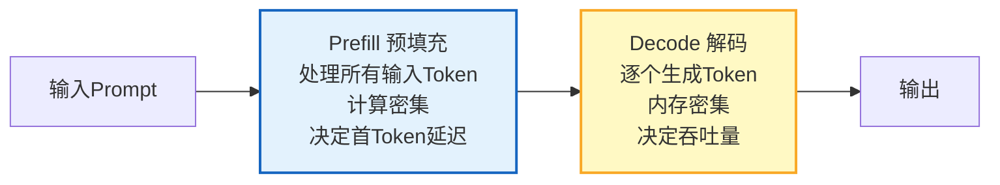
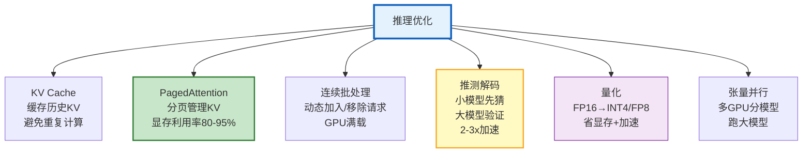
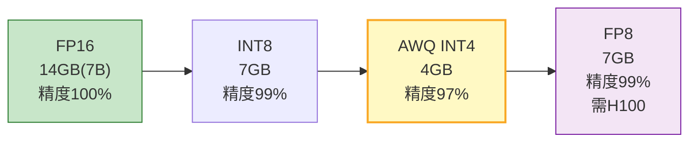
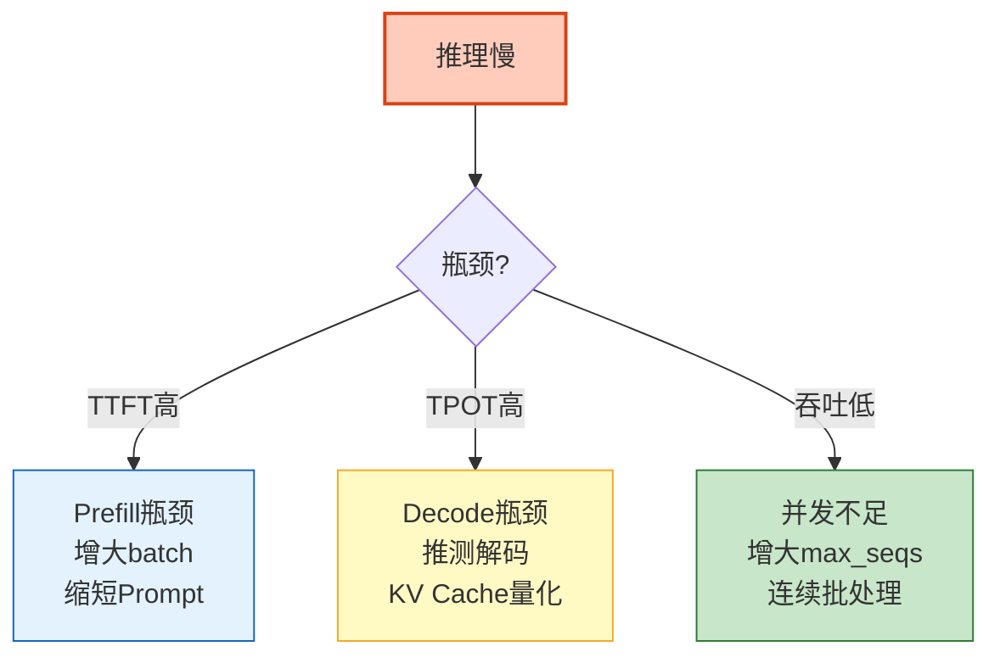

# LLM 推理引擎深度优化图解

> 同一模型优化前后性能差100倍。本图解可视化六大优化技术和性能瓶颈诊断。

---

## 推理两阶段

---

## 六大优化技术

---

## 量化对比

---

## 性能瓶颈诊断

---

## 引擎性能对比（A100 80GB, 7B模型）

| 引擎 | 吞吐量 | TTFT | 并发 |
|------|--------|------|------|
| vLLM | 4000 | 30ms | 100 |
| SGLang | 4500 | 25ms | 120 |
| TGI | 3000 | 40ms | 80 |
| Ollama | 800 | 80ms | 5 |

---

## 检查清单

| 检查项 | 状态 |
|--------|------|
| 理解Prefill/Decode | ☐ |
| KV Cache原理 | ☐ |
| PagedAttention | ☐ |
| 连续批处理 | ☐ |
| 推测解码 | ☐ |
| 量化方案选择 | ☐ |
| vLLM生产配置 | ☐ |
| 性能诊断 | ☐ |
