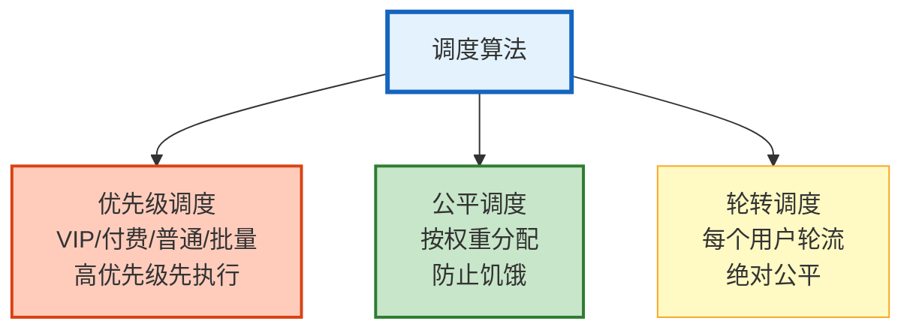
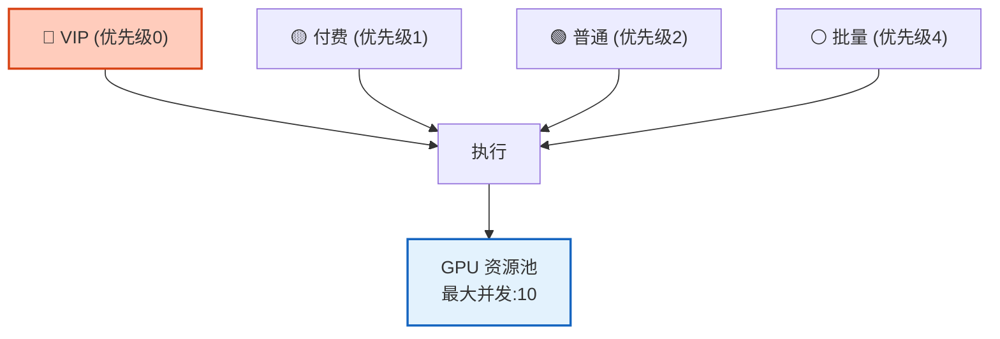
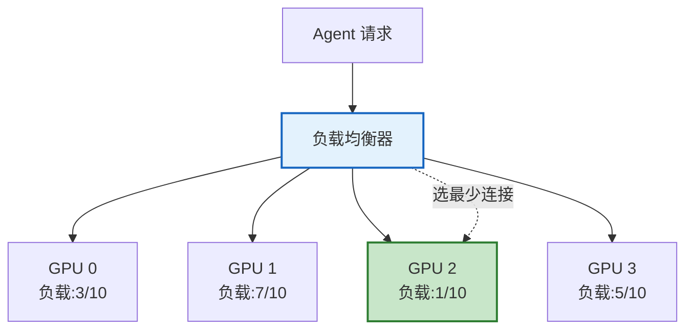

# 多 Agent 博弈与资源调度图解

> 多个 Agent 竞争有限资源时怎么管？本图解可视化调度算法和博弈机制。

---

## 调度算法对比



---

## 优先级队列



---

## 多层限流

```mermaid
graph TB
    REQ["请求"] --> L1["第1层: 用户级<br/>RPM/TPM限制"]
    L1 -->|"通过"| L2["第2层: 全局级<br/>总容量限制"]
    L2 -->|"通过"| L3["第3层: 模型级<br/>单模型并发限制"]
    L3 -->|"通过"| EXEC["✅ 执行"]
    L1 -.->"超限"| REJECT1["⛔ 限流"]
    L2 -.->"超限"| REJECT2["⛔ 排队"]
    L3 -.->"超限"| FALL["🔄 降级模型"]

    style L1 fill:#FFCCBC,stroke:#D84315
    style L2 fill:#FFF9C4,stroke:#F9A825
    style L3 fill:#F3E5F5,stroke:#7B1FA2
    style EXEC fill:#C8E6C9,stroke:#2E7D32,stroke-width:2px
```

---

## 负载均衡



---

## 博弈机制

| 机制 | 原理 | 应用 |
|------|------|------|
| 拍卖 | Agent 出价竞争资源 | GPU 时间分配 |
| 预算博弈 | 按贡献度分配预算 | 多 Agent 预算 |
| 纳什均衡 | 稳定的资源分配 | 长期调度策略 |
| 合作博弈 | Agent 合作最大化总收益 | 多 Agent 协作 |

---

## 检查清单

| 检查项 | 状态 |
|--------|------|
| 理解资源竞争场景 | ☐ |
| 优先级调度 | ☐ |
| 公平调度 | ☐ |
| 负载均衡 | ☐ |
| 多层限流 | ☐ |
| 拍卖机制 | ☐ |
| 预算分配博弈 | ☐ |
| LangGraph 集成 | ☐ |
