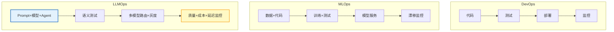
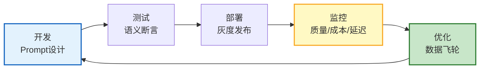
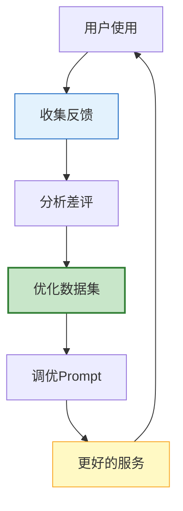

# LLMOps 与 Agent 全生命周期运维图解

> DevOps→MLOps→LLMOps 的演进。本图解可视化 LLMOps 全生命周期闭环。

---

## 三者对比

---

## 生命周期闭环

---

## 数据飞轮

---

## 灰度发布阶段

---

## 检查清单

| 检查项 | 状态 |
|--------|------|
| 理解LLMOps vs MLOps | ☐ |
| Prompt版本管理 | ☐ |
| 模型AB测试 | ☐ |
| 线上质量监控 | ☐ |
| 数据飞轮 | ☐ |
| 灰度发布 | ☐ |
