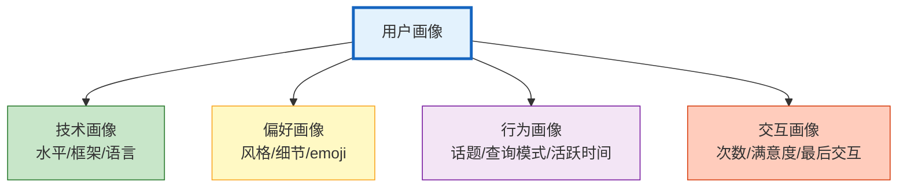
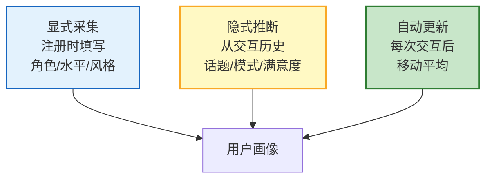
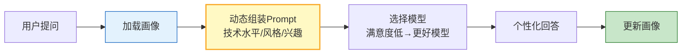

# Agent 个性化与用户画像系统图解

> 同一 Agent 对不同用户给出不同回答。本图解可视化画像构建和个性化策略。

---

## 画像维度

---

## 画像构建

---

## 个性化流程

---

## 技术水平适配

| 水平 | 回答策略 | 示例 |
|------|---------|------|
| 入门 | 通俗语言+详细步骤+避免术语 | "RAG 就像是帮AI查资料再回答" |
| 中级 | 专业术语+适度深度 | "RAG 通过向量检索增强生成" |
| 专家 | 直接技术细节+不解释基础 | "PagedAttention + Continuous Batching" |

---

## 检查清单

| 检查项 | 状态 |
|--------|------|
| 理解画像维度 | ☐ |
| 显式+隐式采集 | ☐ |
| 画像自动更新 | ☐ |
| 画像驱动Prompt | ☐ |
| 个性化推荐 | ☐ |
| LangGraph集成 | ☐ |
