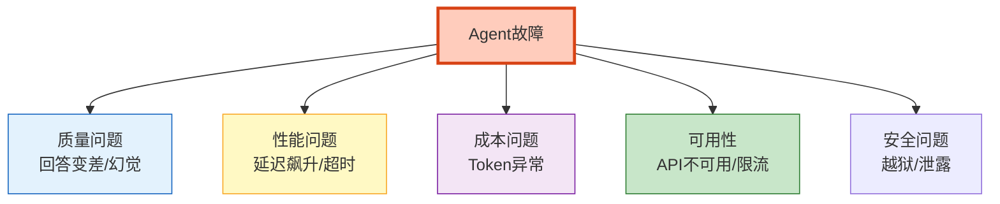
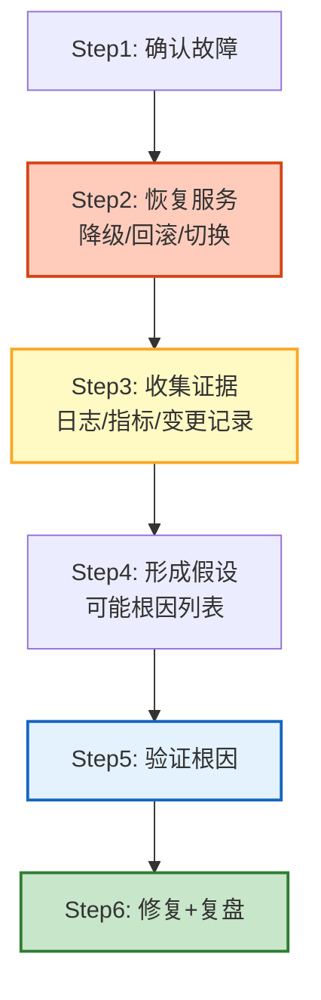
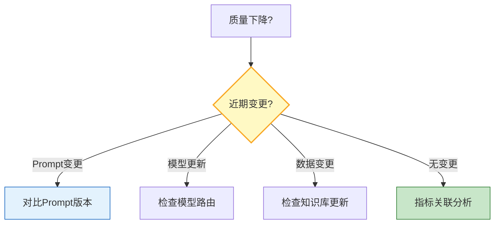

# 事件响应与根因分析图解

> 线上出问题了——先恢复服务再找根因。本图解可视化故障分类和五步根因法。

---

## 故障分类

---

## 五步根因法

---

## 事件分级

| 级别 | 影响 | 响应时间 | 行动 |
|------|------|---------|------|
| P0 | 全面不可用 | 5分钟 | 切备用+通知全体 |
| P1 | 严重降级 | 15分钟 | 排查+考虑回滚 |
| P2 | 部分受损 | 1小时 | 分析日志 |
| P3 | 轻微影响 | 4小时 | 记录待处理 |

---

## 根因排查路径

---

## 检查清单

| 检查项 | 状态 |
|--------|------|
| 理解五类故障 | ☐ |
| 事件分级 | ☐ |
| 五步根因法 | ☐ |
| 变更分析 | ☐ |
| 指标关联 | ☐ |
| 自动诊断 | ☐ |
| 复盘报告 | ☐ |
