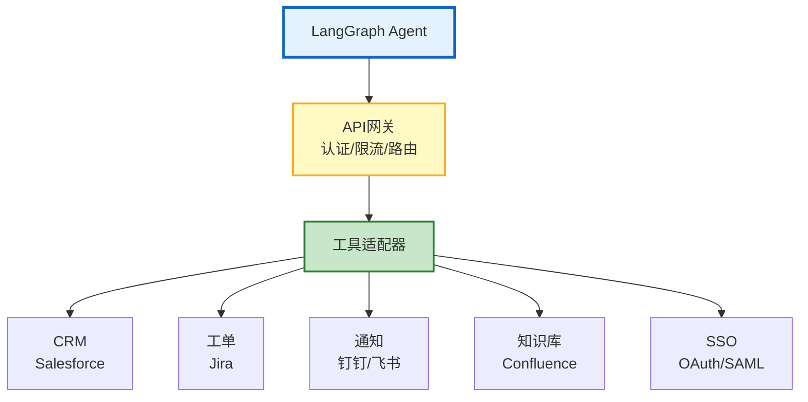
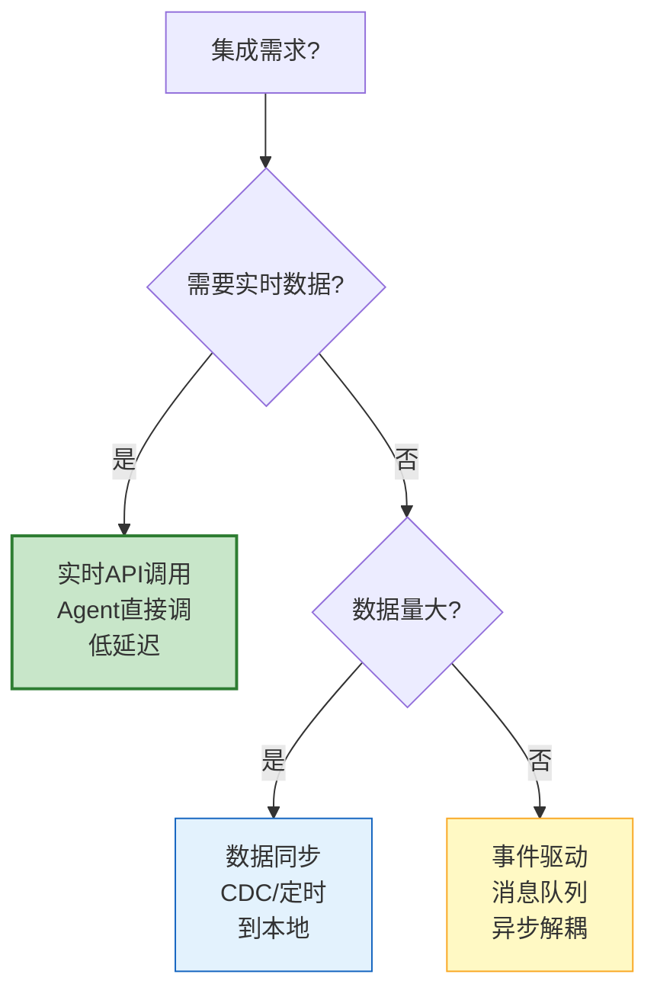
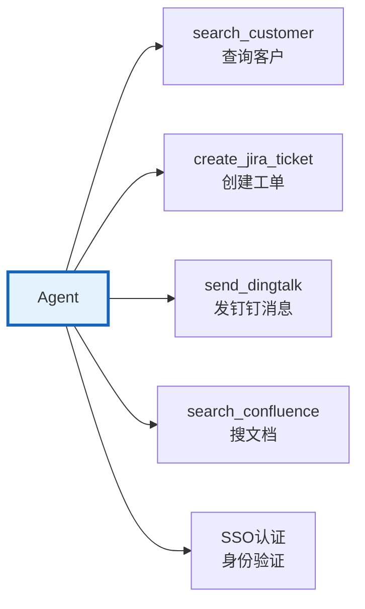
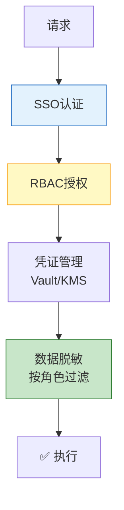

# 企业 Agent 集成与系统对接图解

> Agent 对接 CRM/工单/通知/知识库/SSO。本图解可视化集成架构和工具封装。

---

## 集成架构

---

## 集成模式

---

## 工具封装示例

---

## 安全层

---

## 检查清单

| 检查项 | 状态 |
|--------|------|
| 理解五种集成模式 | ☐ |
| CRM工具封装 | ☐ |
| 工单系统工具 | ☐ |
| 消息通知工具 | ☐ |
| 知识库搜索 | ☐ |
| SSO认证集成 | ☐ |
| CDC数据同步 | ☐ |
| 凭证管理 | ☐ |
