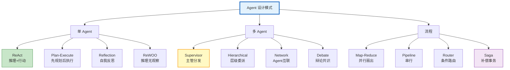
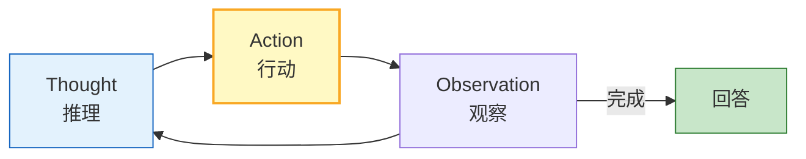

# Agent 设计模式与参考架构图解

> 12 种 Agent 设计模式一图看懂。本图解可视化模式分类和选型矩阵。

---

## 12 种模式分类

---

## ReAct 循环

---

## 选型矩阵

| 需求 | 推荐 | 备选 |
|------|------|------|
| 通用问答 | ReAct | Plan-Execute |
| 复杂多步 | Plan-Execute | ReWOO |
| 高质量 | Reflection | Debate |
| 多角色 | Supervisor | Hierarchical |
| 多角度 | Debate | Map-Reduce |
| 批量 | Map-Reduce | Pipeline |
| 分流 | Router | Supervisor |
| 事务 | Saga | Pipeline |

---

## 检查清单

| 检查项 | 状态 |
|--------|------|
| 理解12种模式 | ☐ |
| ReAct/Plan-Execute | ☐ |
| Reflection/Debate | ☐ |
| Supervisor/Hierarchical | ☐ |
| Map-Reduce/Saga | ☐ |
| 模式组合 | ☐ |
