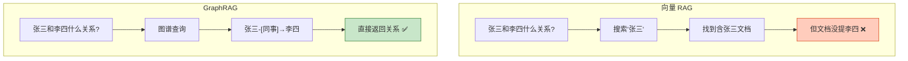
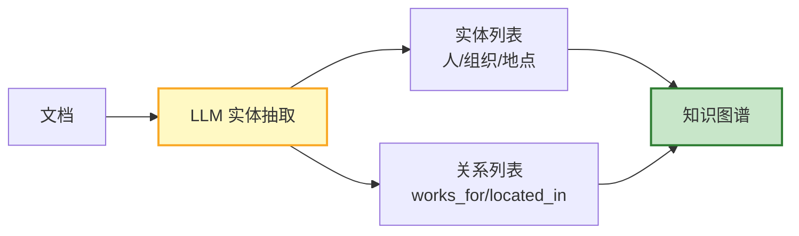
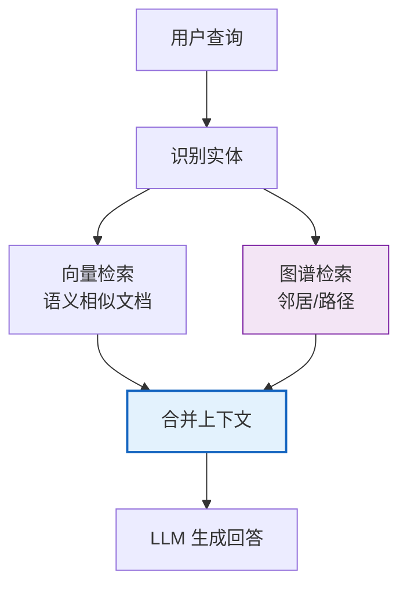

# GraphRAG 与知识图谱实体抽取图解

> 向量 RAG 找不到关系，GraphRAG 沿图谱"走"。本图解可视化图谱构建和混合检索。

---

## 向量 RAG vs GraphRAG

---

## 图谱构建流程

---

## 混合检索

---

## 检索能力对比

| 能力 | 向量RAG | GraphRAG |
|------|---------|----------|
| 相似检索 | ★★★★★ | ★★★ |
| 关系推理 | ★ | ★★★★★ |
| 多跳查询 | ❌ | ★★★★★ |
| 实体汇总 | ❌ | ★★★★ |
| 构建成本 | 低 | 高 |

---

## 检查清单

| 检查项 | 状态 |
|--------|------|
| 理解向量vs图谱 | ☐ |
| 实体关系抽取 | ☐ |
| 图谱存储 | ☐ |
| 邻居/路径查找 | ☐ |
| 混合检索 | ☐ |
| Neo4j 集成 | ☐ |
