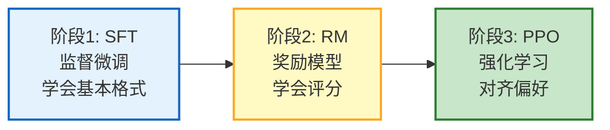
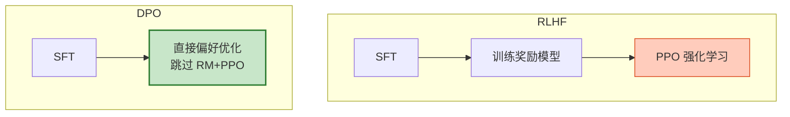
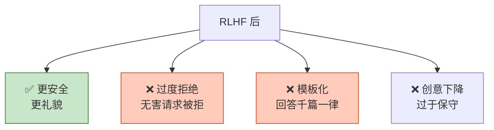
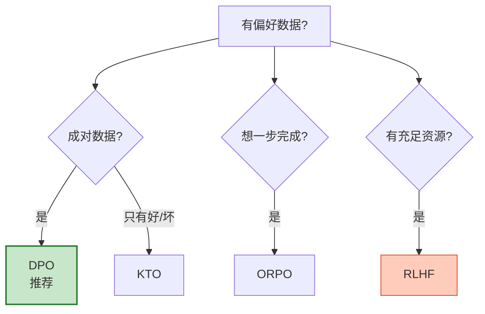

# 强化学习与 RLHF 对齐图解

> SFT→RM→PPO 三阶段让模型对齐人类偏好。本图解可视化 RLHF 全流程和 DPO 简化方案。

---

## RLHF 三阶段

---

## DPO 简化

---

## 方法对比

| 维度 | RLHF | DPO | ORPO |
|------|------|-----|------|
| 奖励模型 | 需要 | 不需要 | 不需要 |
| 参考模型 | 需要 | 需要 | 不需要 |
| 复杂度 | 高 | 中 | 低 |
| 显存 | 最高 | 中 | 最低 |
| 效果 | 略好 | 接近 | 接近 |

---

## RLHF 副作用

---

## 选型决策

---

## 检查清单

| 检查项 | 状态 |
|--------|------|
| 理解RL三阶段 | ☐ |
| 理解PPO原理 | ☐ |
| 理解DPO简化 | ☐ |
| 方法选型 | ☐ |
| 理解RLHF副作用 | ☐ |
| 偏好数据质量 | ☐ |
