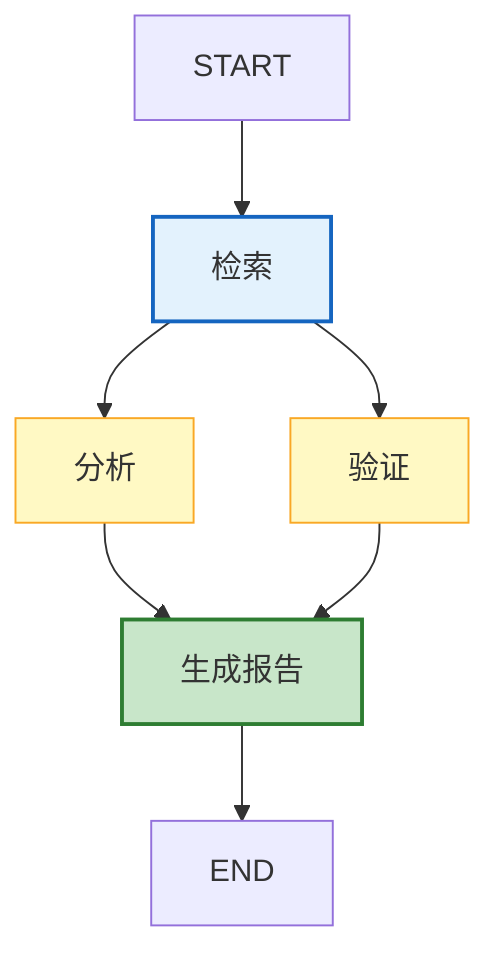
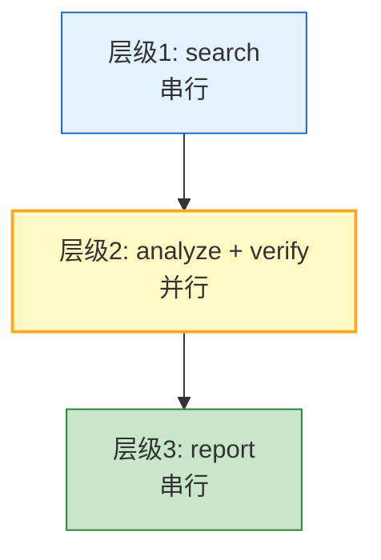
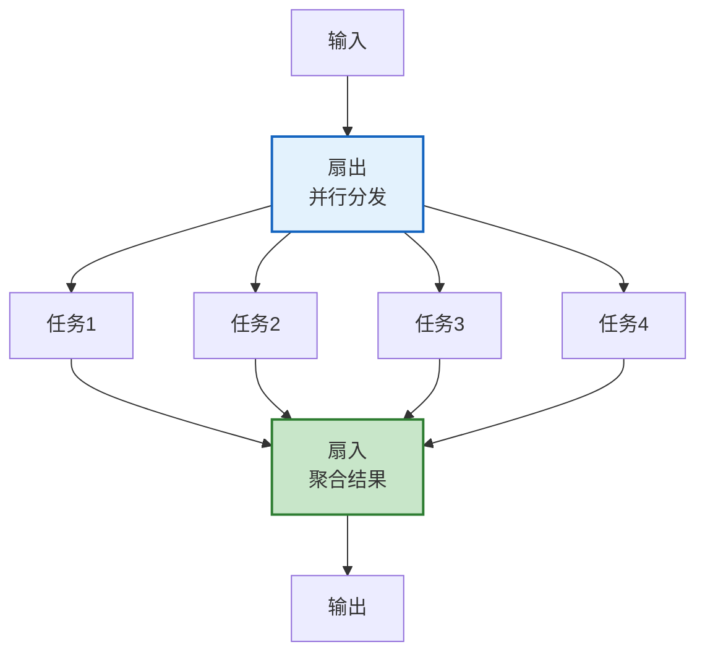
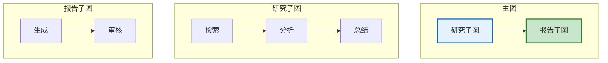

# Agent 数据流与 DAG 编排引擎图解

> LangGraph 本质是 DAG——拓扑排序决定执行顺序，并行扇出提升效率。本图解可视化 DAG 执行模型。

---

## DAG 执行模型

---

## 拓扑排序层级

---

## 扇出扇入

---

## 子图嵌套

---

## 引擎对比

| 引擎 | 定位 | 适用 |
|------|------|------|
| LangGraph | Agent编排 | LLM Agent |
| Temporal | 微服务工作流 | 跨服务编排 |
| Airflow | 数据管道 | ETL/定时 |

---

## 检查清单

| 检查项 | 状态 |
|--------|------|
| 理解DAG模型 | ☐ |
| 拓扑排序 | ☐ |
| 扇出扇入 | ☐ |
| 动态编排 | ☐ |
| 子图嵌套 | ☐ |
| 数据依赖追踪 | ☐ |
