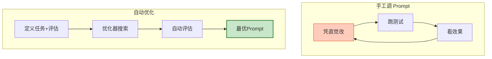
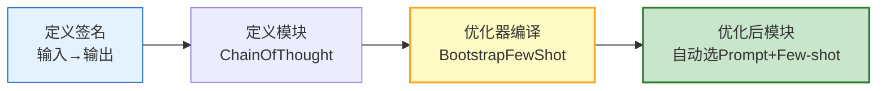
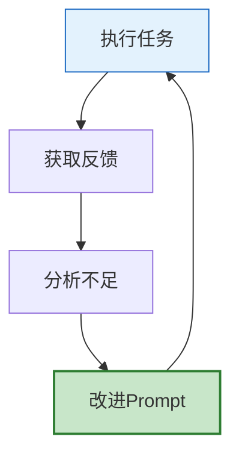

# 自动 Prompt 优化与元学习图解

> 不写 Prompt，写签名；不手动调，用优化器搜索。本图解可视化 DSPy 和 APO 流程。

---

## 手工 vs 自动

---

## DSPy 流程

---

## 自我改进循环

---

## 检查清单

| 检查项 | 状态 |
|--------|------|
| 理解自动优化价值 | ☐ |
| DSPy 签名+模块 | ☐ |
| DSPy 优化器 | ☐ |
| APO 元Prompt | ☐ |
| 自我改进循环 | ☐ |
