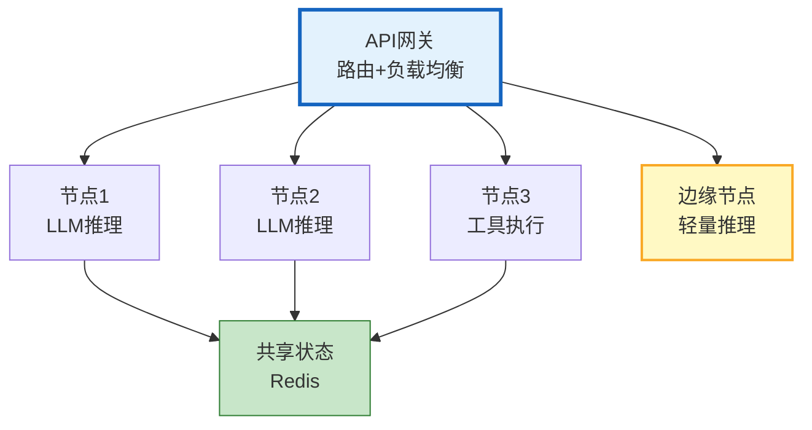
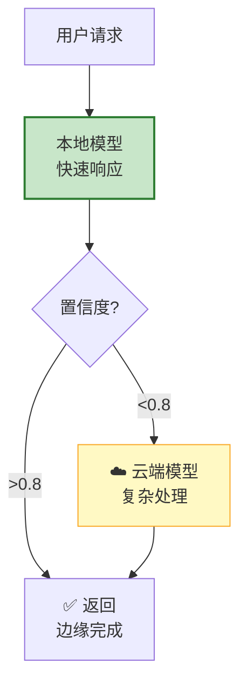
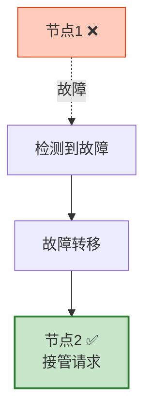

# 分布式 Agent 与边缘部署图解

> Agent 分布到多节点、推理推到边缘设备。本图解可视化分布式架构和边缘路由。

---

## 分布式架构

---

## 边缘智能路由

---

## 容灾故障转移

---

## 检查清单

| 检查项 | 状态 |
|--------|------|
| 理解分布式架构 | ☐ |
| 跨节点通信 | ☐ |
| 边缘智能路由 | ☐ |
| 边缘缓存 | ☐ |
| 分布式状态管理 | ☐ |
| 容灾故障转移 | ☐ |
