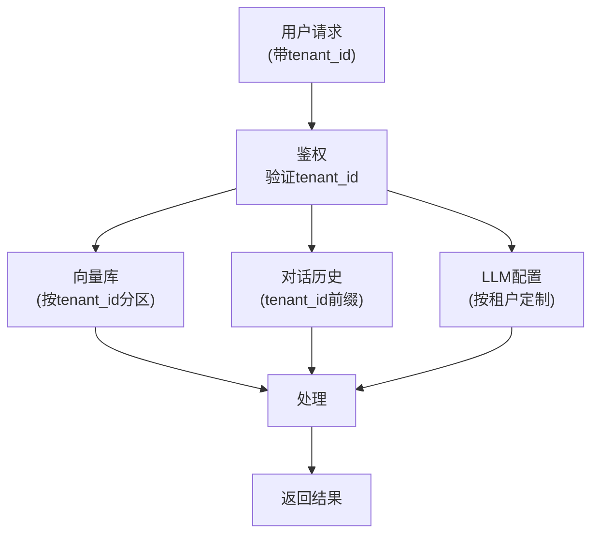

# 多租户架构图解

> 用图解理解多租户 LLM 应用的隔离设计和实现方式。

---

## 一、单租户 vs 多租户

```mermaid
graph TB
    subgraph 单租户 {"单租户: 独立部署"}
        S1["客户A → 独立实例"]
        S2["客户B → 独立实例"]
        S3["客户C → 独立实例"]
        Note1["✅ 完全隔离 ❌ 成本高"]
    end

    subgraph 多租户 {"多租户: 共享+隔离"}
        M1["共享应用"]
        M1 --> MA["客户A数据(隔离)"]
        M1 --> MB["客户B数据(隔离)"]
        M1 --> MC["客户C数据(隔离)"]
        Note2["✅ 成本低 ⚠️ 需严格隔离"]
    end

    style 单租户 fill:'#FFE0B2'
    style 多租户 fill:'#C8E6C9'
```

## 二、三种隔离层级

```mermaid
graph TB
    subgraph 隔离层级 {"三种隔离（从弱到强）"}
        L1["Level 1: 应用层隔离<br/>同一DB + tenant_id过滤<br/>最简单 ✅ 适合起步"]
        L2["Level 2: Schema隔离<br/>每租户独立Schema<br/>DB级隔离"]
        L3["Level 3: 独立DB<br/>每租户独立数据库<br/>最强隔离 ❌ 最贵"]
    end

    L1 --> L2 --> L3

    style L1 fill:'#C8E6C9'
    style L3 fill:'#FFCDD2'
```

## 三、多租户数据流



## 四、隔离检查清单

```mermaid
graph TB
    subgraph 检查 {"多租户隔离检查"}
        C1["✅ 向量库按tenant分区"]
        C2["✅ 对话历史加tenant前缀"]
        C3["✅ LLM配置可定制"]
        C4["✅ 文件按租户分目录"]
        C5["✅ 缓存Key含tenant_id"]
    end

    style 检查 fill:'#E3F2FD'
```
