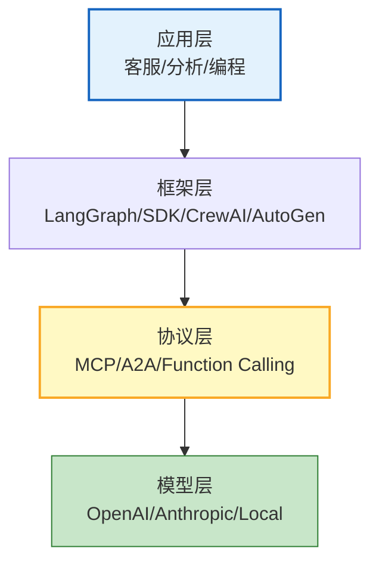
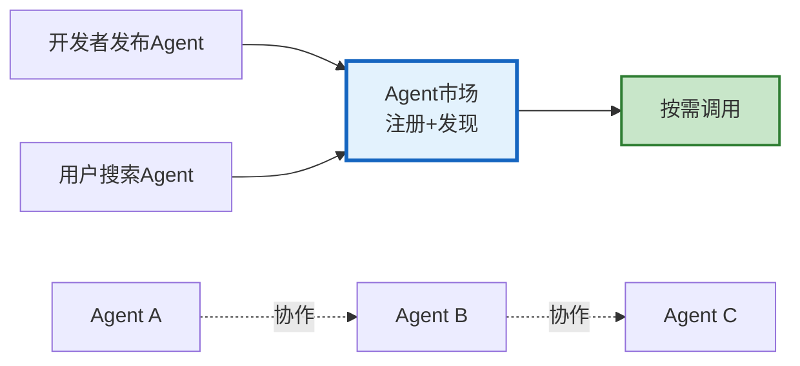

# Agent 生态系统与标准互操作图解

> MCP 连接工具、A2A 连接 Agent、Agent Card 自描述。本图解可视化生态四层和标准现状。

---

## 四层生态

---

## 标准化现状

| 标准 | 层级 | 成熟度 | 采用 |
|------|------|--------|------|
| Function Calling | 模型接口 | 高 | 广泛 |
| MCP | 工具协议 | 中 | 增长中 |
| A2A | Agent通信 | 早期 | Google推动 |
| Agent Card | Agent描述 | 早期 | 研究 |
| OWASP Top10 | 安全 | 中 | 共识 |

---

## Agent 市场愿景

---

## 检查清单

| 检查项 | 状态 |
|--------|------|
| 理解四层生态 | ☐ |
| MCP 工具互操作 | ☐ |
| A2A Agent通信 | ☐ |
| Agent Card | ☐ |
| 跨框架迁移 | ☐ |
| Agent注册中心 | ☐ |
